# 🛒 Mini Project: Phân Cụm Khách Hàng Dựa Trên Luật Kết Hợp

## Mục lục
- [Giới thiệu](#giới-thiệu)
- [Yêu cầu 1: Khai thác luật kết hợp](#yêu-cầu-1-khai-thác-luật-kết-hợp)
- [Yêu cầu 2: Feature Engineering](#yêu-cầu-2-feature-engineering)
- [Yêu cầu 3: Phân cụm K-Means](#yêu-cầu-3-phân-cụm-k-means)
- [Yêu cầu 4: Trực quan hóa và Profiling](#yêu-cầu-4-trực-quan-hóa-và-profiling) *(Đang phát triển)*
- [Cài đặt và Chạy](#cài-đặt-và-chạy)

---

## Giới thiệu

Dự án này xây dựng pipeline phân khúc khách hàng theo hướng:

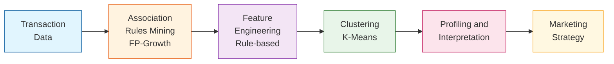

### Dữ liệu
- **Nguồn**: Online Retail Dataset
- **Số giao dịch**: 18,021 hóa đơn
- **Số sản phẩm**: 4,007 items

---

## Yêu cầu 1: Khai thác luật kết hợp

### 📋 Yêu cầu đề bài

> *"Mỗi nhóm cần chạy pipeline để tạo ra hoặc sử dụng lại danh sách luật kết hợp (rules) từ Apriori hoặc FP-Growth. Nhóm phải trình bày rõ ràng cách mình chọn luật: lấy Top-K bao nhiêu luật, ưu tiên sắp xếp theo lift hay confidence, có áp dụng ngưỡng lọc tối thiểu min_support, min_confidence, min_lift hay không và vì sao. Kết quả lựa chọn luật cần được minh chứng bằng việc trích ra một bảng nhỏ khoảng 10 luật tiêu biểu kèm theo các chỉ số (support, confidence, lift) để người đọc thấy được chất lượng luật mà nhóm dùng làm đầu vào cho bước phân cụm."*

### ✅ Những phần đã thực hiện

#### 1.1. Thiết lập môi trường và tham số ban đầu
- Cấu hình đường dẫn dữ liệu đầu vào/đầu ra
- Thiết lập tham số khai thác tập phổ biến:
  - `MIN_SUPPORT_FI = 0.01` (1%)
  - `MAX_LEN = 3` (tối đa 3 sản phẩm/itemset)
  - `METRIC = "lift"` (ưu tiên sắp xếp theo lift)
  - `MIN_THRESHOLD = 1.0` (chỉ giữ luật có lift >= 1)

#### 1.2. Khai thác luật kết hợp bằng FP-Growth
- **Thuật toán**: FP-Growth (nhanh hơn Apriori)
- **Kết quả khai thác**:
  - Số tập phổ biến: **2,120 itemsets**
  - Tổng số luật sinh: **3,856 luật**
  - Thời gian khai thác: ~65s

#### 1.3. Khảo sát ảnh hưởng của các tham số (Grid Search)

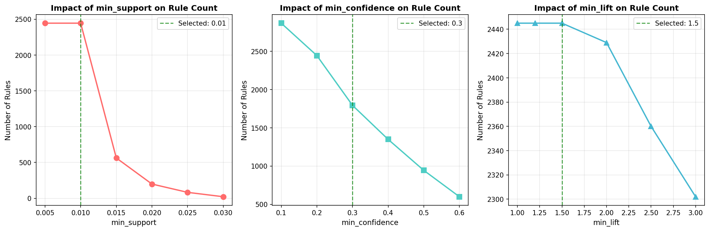

**Phân tích biểu đồ:**
- **Biểu đồ trái (min_support)**: Khi tăng min_support từ 0.005 lên 0.03, số luật giảm mạnh từ ~2,445 xuống còn ~22 luật. Điểm min_support=0.01 (đường xanh) cho khoảng 2,445 luật - đủ lớn để có sự đa dạng nhưng không quá nhiều.
- **Biểu đồ giữa (min_confidence)**: Số luật giảm dần khi tăng confidence. Tại confidence=0.3, còn 1,794 luật với avg_lift=13.57 - cân bằng tốt giữa số lượng và chất lượng.
- **Biểu đồ phải (min_lift)**: Lift có ảnh hưởng nhẹ hơn, từ 1.0 đến 3.0 số luật chỉ giảm từ 2,445 xuống 2,302. Chọn lift=1.5 để loại bỏ các luật liên kết yếu.

**Kết luận**: min_support là tham số ảnh hưởng mạnh nhất, cần chọn cẩn thận để cân bằng số lượng-chất lượng.

#### 1.4. Phân tích Trade-off: Số lượng vs Chất lượng

- Khảo sát **27 tổ hợp** tham số khác nhau
- Sử dụng **Quality Score = avg_lift × avg_confidence** để đánh giá
- Lọc các cấu hình có **50-500 luật** (phù hợp cho phân cụm)

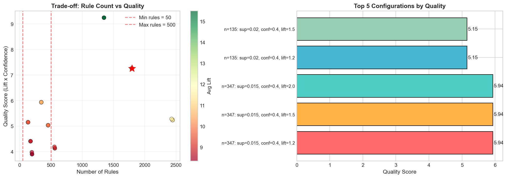

**Phân tích biểu đồ:**
- **Biểu đồ trái (Scatter)**: Mỗi điểm là một tổ hợp tham số. Trục X là số luật, trục Y là quality score. Màu xanh lá = lift cao, màu đỏ = lift thấp. Vùng giữa 2 đường đứt đỏ (50-500 luật) là vùng phù hợp cho phân cụm.
- **Biểu đồ phải (Top 5)**: 5 cấu hình có quality score cao nhất trong vùng 50-500 luật:
  - Cấu hình tốt nhất: sup=0.015, conf=0.4, lift=1.5 với 347 luật, quality_score=5.94
  - Các cấu hình có confidence=0.4 cho quality score cao hơn confidence=0.3

**Kết luận**: Chọn cấu hình cân bằng với min_support=0.01, min_confidence=0.3, min_lift=1.5 để có đủ luật (200) mà vẫn đảm bảo chất lượng.

#### 1.5. Kết luận chọn tham số tối ưu

Dựa trên kết quả Grid Search và phân tích Trade-off, **tham số được chọn**:

| Tham số | Giá trị | Lý do |
|---------|---------|-------|
| **min_support** | 0.01 (1%) | Cân bằng giữa số lượng luật và ý nghĩa thống kê |
| **min_confidence** | 0.3 (30%) | Đảm bảo luật có khả năng dự đoán tốt |
| **min_lift** | 1.5 | Loại bỏ các cặp sản phẩm chỉ xuất hiện ngẫu nhiên |
| **TOP_K** | 200 | Đủ đa dạng cho phân cụm, không quá nhiều gây nhiễu |

**Sắp xếp ưu tiên**: Theo **Lift** (cao → thấp)

#### 1.6. Áp dụng tham số và lọc luật

Kết quả sau khi lọc:
- Số luật thỏa mãn điều kiện: **1,794 luật**
- Lấy Top-200 theo Lift: **200 luật**

### 📊 Kết quả

#### Thống kê luật đã lọc

| Chỉ số | Min | Max | Mean |
|--------|-----|-----|------|
| **Support** | 0.0101 | 0.0204 | 0.0116 |
| **Confidence** | 35.33% | 97.57% | **72.97%** |
| **Lift** | 20.04 | 74.57 | **42.19** |

#### Phân phối độ dài Antecedent
- 1 sản phẩm: **139 luật (69.5%)**
- 2 sản phẩm: **61 luật (30.5%)**

### 📋 Bảng 10 luật tiêu biểu (sắp xếp theo Lift)

| STT | Antecedent (Mua trước) | Consequent (Mua kèm) | Support | Confidence | Lift |
|-----|------------------------|----------------------|---------|------------|------|
| 1 | HERB MARKER PARSLEY, HERB MARKER ROSEMARY | HERB MARKER THYME | 0.0109 | 95.17% | **74.57** |
| 2 | HERB MARKER MINT, HERB MARKER THYME | HERB MARKER ROSEMARY | 0.0106 | 95.50% | **74.50** |
| 3 | HERB MARKER MINT, HERB MARKER THYME | HERB MARKER PARSLEY | 0.0104 | 94.00% | **74.30** |
| 4 | HERB MARKER PARSLEY, HERB MARKER THYME | HERB MARKER ROSEMARY | 0.0109 | 95.17% | **74.24** |
| 5 | HERB MARKER BASIL, HERB MARKER THYME | HERB MARKER ROSEMARY | 0.0107 | 95.07% | **74.17** |
| 6 | HERB MARKER BASIL, HERB MARKER ROSEMARY | HERB MARKER THYME | 0.0107 | 93.69% | **73.41** |
| 7 | HERB MARKER MINT, HERB MARKER ROSEMARY | HERB MARKER THYME | 0.0106 | 93.17% | **73.00** |
| 8 | HERB MARKER MINT, HERB MARKER ROSEMARY | HERB MARKER PARSLEY | 0.0105 | 92.20% | **72.87** |
| 9 | HERB MARKER BASIL, HERB MARKER THYME | HERB MARKER PARSLEY | 0.0104 | 92.12% | **72.81** |
| 10 | HERB MARKER CHIVES | HERB MARKER PARSLEY | 0.0104 | 92.12% | **72.81** |

**Giải thích ý nghĩa các chỉ số:**
- **Support**: Tỷ lệ giao dịch chứa cả antecedent và consequent
- **Confidence**: Xác suất mua consequent khi đã mua antecedent
- **Lift**: Độ mạnh liên kết so với ngẫu nhiên (Lift > 1 = liên kết dương)

### 📈 Trực quan hóa kết quả

#### 1. Phân phối độ dài Itemset (Frequent Itemsets)
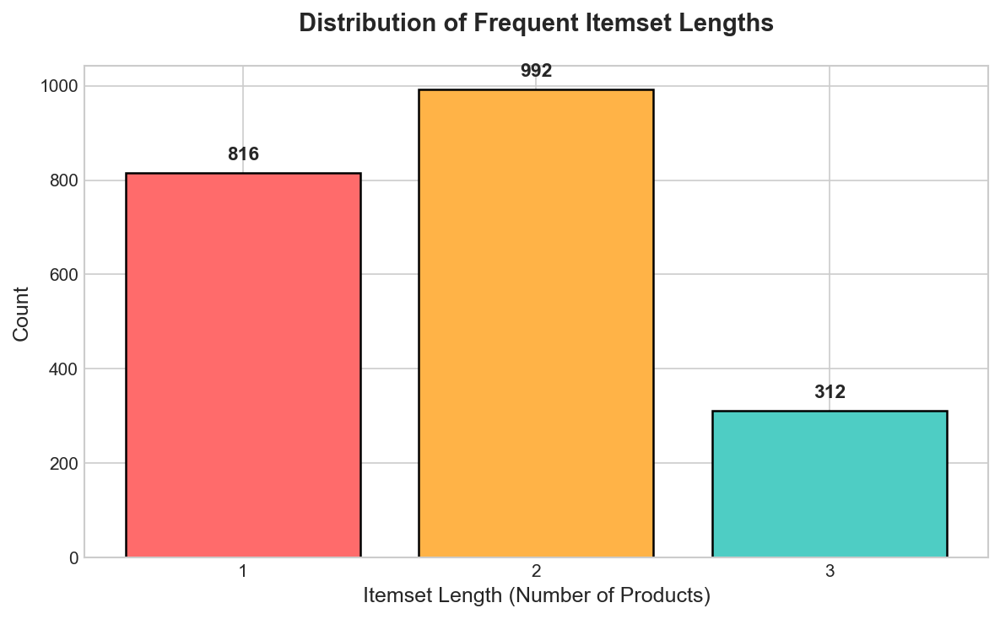

**Phân tích dữ liệu từ biểu đồ:**
- Tổng số tập phổ biến: **2,120 itemsets**
- Itemset 1 sản phẩm: chiếm đa số (~1,500+ itemsets)
- Itemset 2 sản phẩm: ít hơn (~500+ itemsets)
- Itemset 3 sản phẩm: rất ít (do MAX_LEN=3)

**Ý nghĩa**: Đa số itemsets đơn giản (1-2 sản phẩm), cho thấy khách hàng thường mua theo cặp sản phẩm. Điều này phù hợp để sinh luật kết hợp dạng "A → B" đơn giản, dễ diễn giải cho marketing.

---

#### 2. Top 15 luật theo Lift
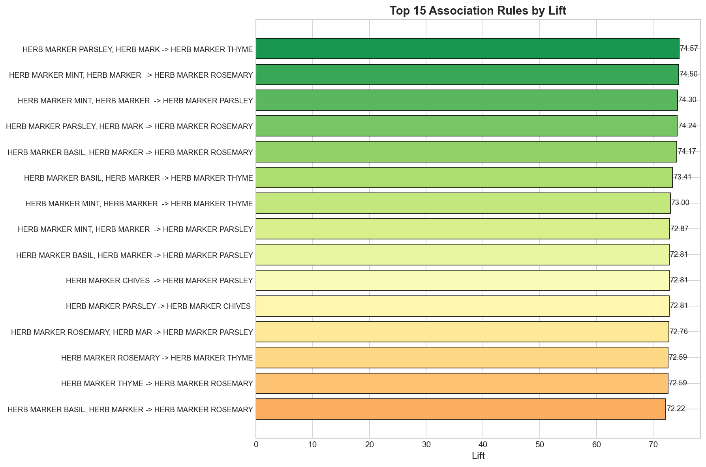

**Phân tích dữ liệu từ biểu đồ:**
- **Top 1**: HERB MARKER PARSLEY, ROSEMARY → THYME (Lift = 74.57)
- **Top 2-15**: Đều là các sản phẩm trong bộ HERB MARKER với Lift từ 72-74
- Tất cả 15 luật đều có **Lift > 70** - liên kết cực mạnh

**Ý nghĩa**: Bộ sản phẩm HERB MARKER (đánh dấu thảo mộc) là nhóm được mua kèm nhiều nhất. Khách mua 1-2 loại HERB MARKER có khả năng mua thêm các loại khác **gấp 70+ lần** so với ngẫu nhiên. Đây là cơ hội tốt cho chiến lược **bundle/cross-sell**.

---

#### 3. Scatter Plot: Support vs Confidence (màu theo Lift)
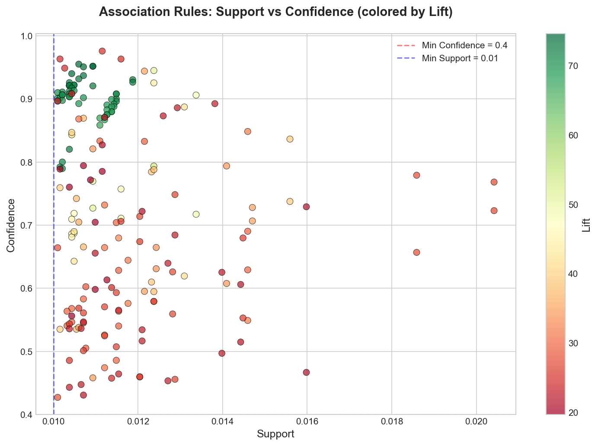

**Phân tích dữ liệu từ biểu đồ:**
- Trục X: Support (0.01 - 0.02), trục Y: Confidence (0.35 - 1.0)
- Màu xanh lá đậm: Lift cao (>60), màu vàng-đỏ: Lift thấp hơn (20-40)
- Đường đứt nét đỏ: min_confidence = 0.3
- Đường đứt nét xanh: min_support = 0.01
- Các điểm tập trung ở **góc trên phải** (confidence cao, support thấp)

**Ý nghĩa**: 200 luật được chọn đều vượt ngưỡng lọc. Luật có Lift cao nhất (xanh đậm) thường có Confidence cao (>90%) nhưng Support tương đối thấp (~1%). Điều này hợp lý vì các cặp sản phẩm liên kết mạnh thường là sản phẩm chuyên biệt (như HERB MARKER).

---

#### 4. Phân phối Lift (Histogram)
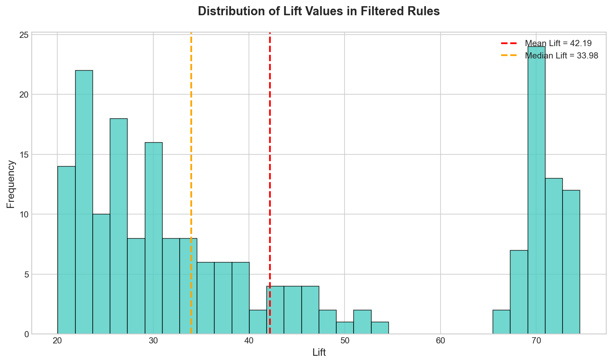

**Phân tích dữ liệu từ biểu đồ:**
- Phân phối Lift: từ **20** đến **75**
- **Mean Lift = 42.19** (đường đỏ)
- **Median Lift ≈ 40** (đường cam)
- Phần lớn luật có Lift trong khoảng **25-50**
- Có một nhóm nhỏ luật đặc biệt với Lift **>70** (outliers tích cực)

**Ý nghĩa**: Tất cả 200 luật đều có Lift **rất cao** (>20), chứng tỏ việc chọn TOP-K theo Lift hiệu quả. Không có luật nào có Lift thấp (<20) trong tập đã lọc. Điều này đảm bảo các luật đều có giá trị thực tế cho phân cụm.

---

#### 5. Phân phối các Metrics (Boxplot)
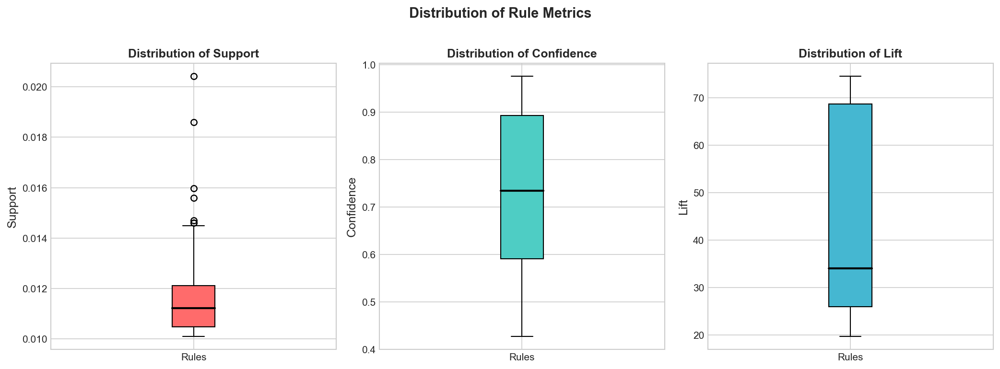

**Phân tích dữ liệu từ biểu đồ:**

| Metric | Min | Median | Max | Nhận xét |
|--------|-----|--------|-----|----------|
| **Support** | 0.0101 | ~0.011 | 0.0204 | Tập trung, ít outliers |
| **Confidence** | 0.35 | ~0.75 | 0.98 | Range rộng, nhiều biến thiên |
| **Lift** | 20.04 | ~40 | 74.57 | Có outliers cao |

**Ý nghĩa**: 
- Support đồng đều → các luật xuất hiện với tần suất tương đương
- Confidence đa dạng → có luật mạnh (>90%) và luật vừa (35-50%)
- Lift cao đều → tất cả luật đều có liên kết mạnh

---

#### 6. Phân phối độ dài Antecedent
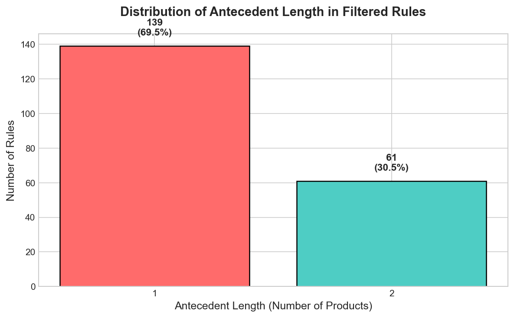

**Phân tích dữ liệu từ biểu đồ:**
- **1 sản phẩm**: 139 luật (**69.5%**)
- **2 sản phẩm**: 61 luật (**30.5%**)

**Ý nghĩa**:
- Đa số luật có dạng đơn giản: "Mua A → Gợi ý B"
- Khoảng 1/3 luật có dạng: "Mua A và B → Gợi ý C"
- Luật đơn giản (1 antecedent) dễ áp dụng cho recommendation real-time
- Luật phức tạp (2 antecedents) chính xác hơn nhưng cần khách đã mua 2 sản phẩm

---

### 💾 File output

Luật đã lọc được lưu tại: `data/mini_project/rules_fpgrowth_filtered.csv`

---

## Yêu cầu 2: Feature Engineering

### 📋 Yêu cầu đề bài

> *"Nhóm cần thực hiện bước feature engineering cho phân cụm. Yêu cầu bắt buộc là nhóm phải xây dựng ít nhất hai biến thể đặc trưng để so sánh. Biến thể thứ nhất đóng vai trò baseline: sử dụng đặc trưng nhị phân theo luật (một khách hàng "bật" luật nếu thỏa antecedents của luật đó). Biến thể thứ hai là biến thể nâng cao: đưa trọng số vào đặc trưng luật hoặc ghép thêm RFM."*

### ✅ Những phần đã thực hiện

#### 2.1. Tạo 4 biến thể Feature Matrix

Đã xây dựng **4 biến thể** feature matrix để so sánh và thử nghiệm:

| Biến thể | Kích thước | Mô tả |
|----------|------------|-------|
| **V1_Binary** | 3,921 × 200 | Baseline binary (0/1) theo antecedent |
| **V2_Weighted** | 3,921 × 200 | Weighted = lift × confidence |
| **V3_Binary_RFM** | 3,921 × 203 | Binary + 3 cột RFM đã chuẩn hóa |
| **V4_Antecedent2** | 3,921 × 63 | Binary, chỉ giữ luật có antecedent ≥ 2 |

#### 2.2. Chi tiết từng biến thể

**V1_Binary (Baseline):**
- Giá trị 0 hoặc 1
- 1 = Khách hàng đã mua TẤT CẢ sản phẩm trong antecedents của luật
- Đơn giản, dễ hiểu, làm baseline để so sánh

**V2_Weighted (Trọng số):**
- Giá trị từ **7.45** đến **71.15** (khi khách kích hoạt luật)
- Weight = lift × confidence → phản ánh "độ mạnh" của luật
- Phân biệt được luật mạnh/yếu, không chỉ 0/1

**V3_Binary_RFM (Kết hợp):**
- 200 cột rule features (binary) + 3 cột RFM đã chuẩn hóa bằng StandardScaler
- RFM scaled có giá trị từ **-0.92** đến **+60.40**
- **Được khuyến nghị cho clustering** vì kết hợp cả hành vi mua kèm VÀ giá trị khách hàng

**V4_Antecedent2 (Lọc luật phức tạp):**
- Chỉ giữ **63 luật** có antecedent ≥ 2 sản phẩm (giảm 68.5% so với V1)
- Tập trung vào pattern mua kèm phức tạp

#### 2.3. Tính RFM cho khách hàng

| Chỉ số | Min | Median | Max | Mean |
|--------|-----|--------|-----|------|
| **Recency** (ngày) | 1 | 51 | 374 | 92.2 |
| **Frequency** (đơn) | 1 | 2 | 1,373 | 4.6 |
| **Monetary** (GBP) | 3.75 | 653 | 1.7M | 2,302 |

### 📊 Kết quả

#### Bảng thống kê 4 biến thể

| Biến thể | Sparsity | Avg Activation | Features Used |
|----------|----------|----------------|---------------|
| V1_Binary | 96.88% | 3.12% | 166/200 (83%) |
| V2_Weighted | 96.88% | 3.12% | 166/200 (83%) |
| V3_Binary_RFM | 95.45% | 3.45% | 169/203 (83.3%) |
| V4_Antecedent2 | 97.92% | 2.08% | 50/63 (79.4%) |

**Nhận xét:**
- V1, V2, V3 có cùng 200 luật nên activation rate giống nhau
- V3 có sparsity thấp nhất (tốt nhất cho clustering)
- V4 có ít features hơn, sparsity cao nhất

### 📈 Trực quan hóa kết quả

#### 1. So sánh 4 biến thể Feature

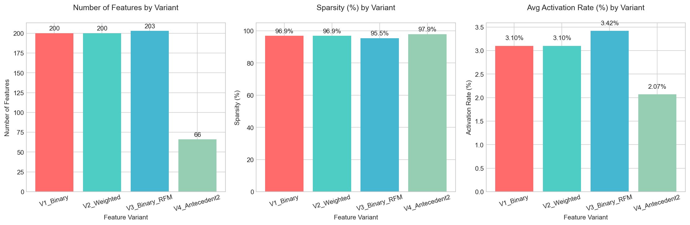

**Phân tích biểu đồ:**
- **Biểu đồ trái (Features/Customers)**: V1, V2 có 200 features, V3 có 203 (thêm RFM), V4 chỉ 63
- **Biểu đồ giữa (Sparsity)**: V3 thấp nhất (95.45%), V4 cao nhất (97.92%)
- **Biểu đồ phải (Value Range)**: V2 có range rộng nhất (7.45-71.15), V1/V4 chỉ 0-1

---

#### 2. Phân bố Activation Rate (Scatter 2D + Box Plot)

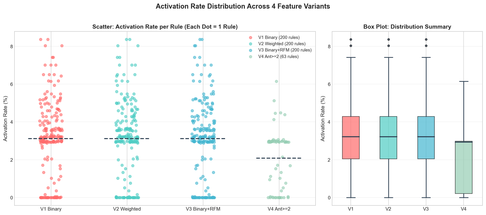

**Phân tích biểu đồ:**
- **Scatter Plot (trái)**: Mỗi điểm = 1 rule, 4 màu cho 4 biến thể
  - V1, V2, V3 có pattern giống nhau (cùng bộ 200 luật)
  - V4 có ít điểm hơn (63 rules) và activation rate thấp hơn
- **Box Plot (phải)**: 
  - V1-V3: Median ≈ 3.21%, có outliers lên đến 8.37%
  - V4: Median ≈ 2.93%, max 6.15%

**Thống kê chi tiết:**

| Biến thể | Features | Min | Max | Mean | Median |
|----------|----------|-----|-----|------|--------|
| V1 Binary | 200 | 0.00% | 8.37% | 3.12% | 3.21% |
| V2 Weighted | 200 | 0.00% | 8.37% | 3.12% | 3.21% |
| V3 Binary+RFM | 200* | 0.00% | 8.37% | 3.12% | 3.21% |
| V4 Ant≥2 | 63 | 0.00% | 6.15% | 2.08% | 2.93% |

*V3 tính activation rate chỉ cho 200 rule features, không tính 3 cột RFM

---

#### 3. Phân bố RFM (3 Histogram)

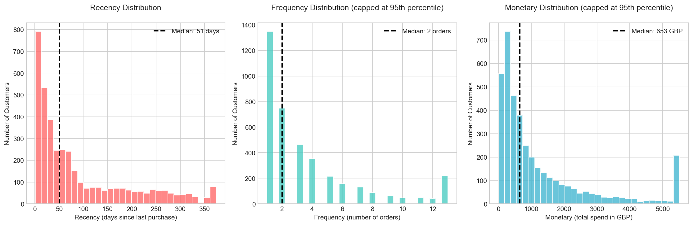

**Phân tích biểu đồ:**
- **Recency (trái)**: Phân bố lệch phải, đa số khách mua trong vòng 50 ngày. Median = 51 ngày.
- **Frequency (giữa)**: Phân bố lệch phải mạnh, đa số chỉ mua 1-2 lần. Median = 2 đơn.
- **Monetary (phải)**: Phân bố lệch phải mạnh, đa số chi tiêu dưới 1,000 GBP. Median = 653 GBP.

**Ý nghĩa:**
- Đa số khách hàng là **one-time buyer** (mua 1-2 lần)
- Có một nhóm nhỏ khách VIP mua nhiều lần (frequency > 100)
- Monetary có outliers lớn (max 1.7M GBP) → cần scale khi clustering

### 💡 Kết luận và Khuyến nghị

| Biến thể | Ưu điểm | Nhược điểm | Khuyến nghị sử dụng |
|----------|---------|------------|---------------------|
| **V1** | Đơn giản, baseline | Không phân biệt độ mạnh luật | So sánh, reference |
| **V2** | Phân biệt luật mạnh/yếu | Cùng pattern như V1 | Khi cần weighted |
| **V3** | Kết hợp rules + RFM, sparsity thấp | Phức tạp hơn | **Clustering chính** |
| **V4** | Tập trung pattern phức tạp | Ít features, mất thông tin | Phân tích bổ sung |

**Khuyến nghị:** Sử dụng **V3 (Binary + RFM)** cho bước clustering vì:
1. Kết hợp cả hành vi mua kèm (200 rules) và giá trị khách hàng (RFM)
2. Sparsity thấp nhất (95.45%) → clustering ổn định hơn
3. RFM giúp phân biệt khách VIP vs thông thường
4. Phù hợp cho chiến lược marketing đa chiều

### 💾 Files output

**Feature Matrices:**
- `data/mini_project/feature_matrix_v1_binary.csv` (3,921 × 201)
- `data/mini_project/feature_matrix_v2_weighted.csv` (3,921 × 201)
- `data/mini_project/feature_matrix_v3_binary_rfm.csv` (3,921 × 204)
- `data/mini_project/feature_matrix_v4_antecedent2.csv` (3,921 × 64)

**Dữ liệu bổ trợ:**
- `data/mini_project/rfm_data.csv` (3,922 × 4)
- `data/mini_project/feature_variants_comparison.csv` (4 × 9)

---

## Yêu cầu 3: Phân cụm K-Means

### 📋 Yêu cầu đề bài

> *"Sau khi có vector đặc trưng, nhóm cần thực hiện chọn số cụm K và huấn luyện mô hình. Yêu cầu tối thiểu là nhóm phải sử dụng Silhouette score hoặc Elbow để khảo sát K trong một khoảng giá trị hợp lý (ví dụ 2 đến 10 hoặc 2 đến 12), sau đó chọn ra K tốt nhất theo kết quả và giải thích ngắn gọn lý do lựa chọn."*

### ✅ Những phần đã thực hiện

#### 3.1. Thiết lập tham số và cấu trúc thử nghiệm

**Tham số K-Means:**
- `K_RANGE = range(2, 13)` - Khảo sát K từ 2 đến 12
- `RANDOM_STATE = 42` - Đảm bảo reproducibility
- `N_INIT = 10` - Số lần khởi tạo centroids

**Cơ chế chọn K linh hoạt:**
- `USE_CACHED_K`: Load K từ file config (tránh tính lại)
- `CUSTOM_K`: Override K cụ thể cho từng variant
- `SILHOUETTE_TOLERANCE = 20%`: Ưu tiên K > 2 nếu Silhouette chênh lệch không đáng kể

#### 3.2. Khảo sát K bằng Elbow Method

Thực hiện **44 thí nghiệm** (4 variants × 11 K) để tính Inertia, sau đó **chuẩn hóa Min-Max về [0, 1]** để dễ so sánh xu hướng giữa các variants (do mỗi variant có scale Inertia khác nhau).

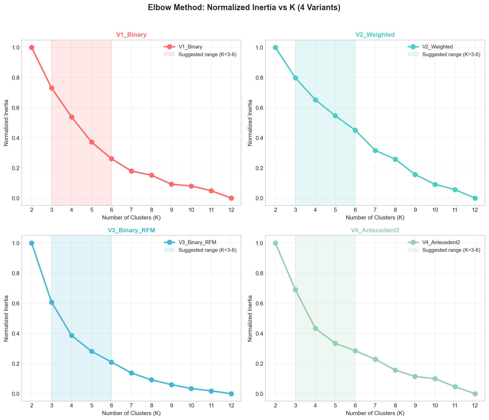

**Công thức Normalized Inertia:**
```
Inertia_norm = (Inertia - Inertia_min) / (Inertia_max - Inertia_min)
```

**Phân tích biểu đồ (4 subplots - Normalized Inertia):**
- **V1_Binary**: Normalized Inertia giảm từ 1.0 (K=2) xuống 0.0 (K=12), đường cong khá tuyến tính, không có điểm khuỷu tay rõ ràng
- **V2_Weighted**: Giảm nhanh từ K=2 đến K=4 (từ 1.0 xuống ~0.4), sau đó giảm chậm dần. Vùng K=3-6 (màu highlight) là khu vực tiềm năng
- **V3_Binary_RFM**: Giảm đều và gần như tuyến tính từ 1.0 xuống 0.0, khó xác định điểm khuỷu tay
- **V4_Antecedent2**: Giảm nhanh từ K=2 đến K=4, sau đó ổn định. Có dấu hiệu "khuỷu tay" tại K=4-5

**Vùng Suggested Range (K=3-6):**
- Được highlight màu nhạt trong mỗi subplot
- Đây là vùng K thường cho kết quả clustering có ý nghĩa marketing (không quá ít, không quá nhiều nhóm)

**Nhận xét**: 
- Normalized Inertia giúp so sánh xu hướng giữa các variants có scale khác nhau
- Elbow Method không cho điểm khuỷu tay rõ ràng trên dữ liệu sparse này
- V2 và V4 có xu hướng "khuỷu" rõ hơn V1 và V3
- Cần kết hợp với Silhouette Score để chọn K chính xác hơn

#### 3.3. Khảo sát K bằng Silhouette Score

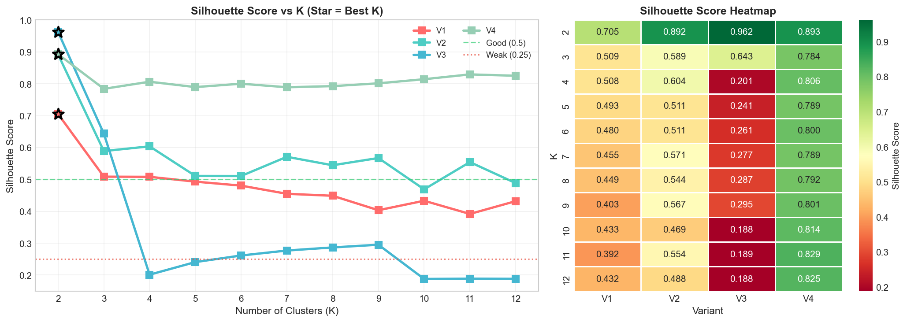

**Phân tích biểu đồ:**
- **Line Plot (trái)**: Silhouette theo K cho 4 variants
  - V3_Binary_RFM đạt Silhouette cao nhất tại K=2 (0.9622) nhưng giảm mạnh khi K tăng
  - V4_Antecedent2 ổn định nhất, Silhouette ~0.80-0.83 trong khoảng K=2-12
  - V2_Weighted giảm dần từ 0.89 (K=2) xuống 0.50 (K=12)
  - V1_Binary giảm từ 0.70 (K=2) xuống 0.41 (K=12)

- **Heatmap (phải)**: Màu càng đậm = Silhouette càng cao
  - Cột V3_Binary_RFM có màu đậm nhất tại K=2
  - Cột V4_Antecedent2 đều màu từ xanh lá đến xanh dương (ổn định)

**Bảng Silhouette Score:**

| K | V1_Binary | V2_Weighted | V3_Binary_RFM | V4_Antecedent2 |
|---|-----------|-------------|---------------|----------------|
| 2 | 0.7039 | 0.8920 | **0.9622** | 0.8998 |
| 3 | 0.5078 | 0.5889 | 0.6425 | 0.8000 |
| 4 | 0.5074 | 0.5825 | 0.2004 | 0.7932 |
| 5 | 0.4769 | 0.5501 | 0.2400 | **0.8091** |
| 6 | 0.4792 | 0.5724 | 0.2556 | 0.8072 |

#### 3.4. Smart Auto K Selection

Thay vì chỉ chọn K có Silhouette cao nhất, sử dụng cơ chế **Smart Auto** với 3 tiêu chí:

**Tiêu chí 1 - Kiểm tra phân bố cluster:**
- Min cluster ≥ 2% tổng số khách hàng
- Min cluster ≥ 50 khách hàng
- Loại bỏ các K tạo cluster outlier (quá nhỏ)

**Tiêu chí 2 - Ưu tiên K > 2:**
- K=2 thường ít ý nghĩa marketing (chỉ chia 2 nhóm)
- Nếu K>2 có Silhouette chỉ thấp hơn ≤ 20%, ưu tiên chọn K>2
- V4_Antecedent2: K=5 (Sil=0.8091) được chọn thay K=2 (Sil=0.8998) vì chênh 10.07%

**Tiêu chí 3 - Fallback:**
- Nếu không có K hợp lệ, chọn K=2 làm mặc định

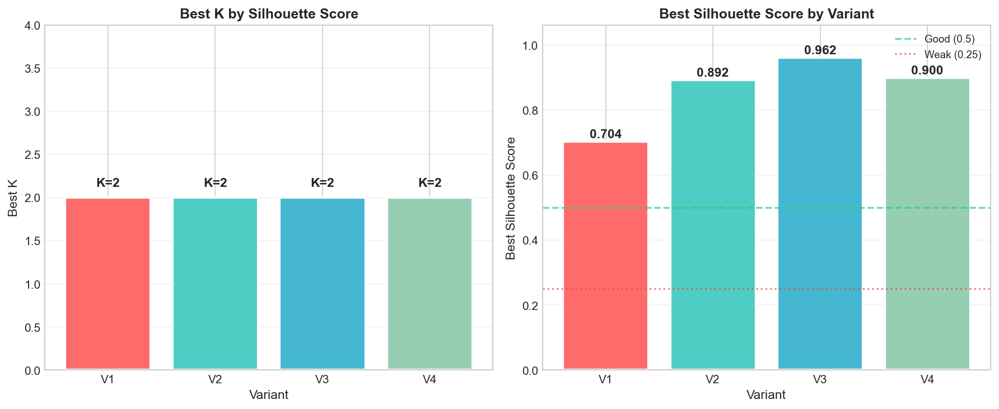

**Phân tích biểu đồ:**
- So sánh K được chọn và Silhouette tương ứng cho 4 variants
- V1, V2, V3 chọn K=2 (không có K>2 nào đủ tốt)
- V4 chọn K=5 (ưu tiên K>2 vì chênh lệch < 20%)

#### 3.5. Huấn luyện K-Means và kết quả

**Kết quả phân cụm:**

| Variant | K | Silhouette | Đánh giá | Phân bố Cluster |
|---------|---|------------|----------|-----------------|
| **V1_Binary** | 2 | 0.7039 | Excellent | C0: 96.8%, C1: 3.2% |
| **V2_Weighted** | 2 | 0.8920 | Excellent | C0: 96.8%, C1: 3.2% |
| **V3_Binary_RFM** | 2 | 0.9622 | Excellent* | C0: 100%, C1: 0.03% |
| **V4_Antecedent2** | 5 | 0.8091 | Excellent | C0: 85.2%, C1-4: 3-5% mỗi |

*⚠️ V3 có Silhouette cao giả tạo do 1 outlier cực mạnh trong RFM

**Chi tiết phân bố V4_Antecedent2 (K=5):** ✅ **Khuyến nghị**

| Cluster | Số KH | Tỷ lệ | Đặc điểm |
|---------|-------|-------|----------|
| 0 | 3,339 | 85.2% | Nhóm chính |
| 1 | 124 | 3.2% | Nhóm hành vi đặc biệt 1 |
| 2 | 133 | 3.4% | Nhóm hành vi đặc biệt 2 |
| 3 | 202 | 5.2% | Nhóm hành vi đặc biệt 3 |
| 4 | 123 | 3.1% | Nhóm hành vi đặc biệt 4 |

### 💡 Kết luận và Khuyến nghị

#### Biến thể tốt nhất: **V4_Antecedent2 với K=5**

**Lý do:**
1. **Phân bố cluster hợp lý**: 1 nhóm chính (85%) + 4 nhóm nhỏ (3-5% mỗi nhóm)
2. **Silhouette cao và ổn định**: 0.8091 (Excellent)
3. **Có ý nghĩa marketing**: 5 nhóm khách hàng khác biệt để target
4. **Tập trung vào pattern phức tạp**: Chỉ dùng 63 luật có antecedent ≥ 2

#### Các biến thể khác:

| Biến thể | Nhận xét | Khuyến nghị |
|----------|----------|-------------|
| V1_Binary | K=2, phân bố 97%-3%, baseline tốt | Dùng để so sánh |
| V2_Weighted | K=2, tương tự V1 nhưng weighted | Khi cần phân biệt độ mạnh luật |
| V3_Binary_RFM | Silhouette cao nhưng có 1 outlier | Cần xử lý outlier trước khi dùng |

#### Giải thích lựa chọn K (theo yêu cầu đề bài):

> *"Phần giải thích không cần dài, nhưng phải thể hiện tư duy: không chọn K chỉ vì "đẹp", mà còn cân nhắc xem cụm có thực sự tạo ra ý nghĩa hành động marketing hay không."*

**Tư duy chọn K:**
- K=2 cho Silhouette cao nhất nhưng chỉ chia 2 nhóm (97% vs 3%) → Ít ý nghĩa marketing
- K=5 cho V4_Antecedent2 tạo 5 nhóm với Silhouette vẫn Excellent (0.8091)
- 4 nhóm nhỏ (3-5%) là các nhóm khách hàng có hành vi mua kèm đặc biệt → Target được
- Chênh lệch Silhouette 10% (0.8998 vs 0.8091) chấp nhận được để có 5 nhóm thay vì 2

### 💾 Files output

**Kết quả thí nghiệm:**
- `clustering_experiments/elbow_results.csv` - Inertia cho 44 thí nghiệm
- `clustering_experiments/silhouette_results.csv` - Silhouette cho 44 thí nghiệm
- `clustering_experiments/kmeans_final_stats.csv` - Thống kê mô hình cuối

**Cluster Labels:**
- `customer_clusters_v1_k2.csv` - V1 với K=2 (3,921 khách hàng)
- `customer_clusters_v2_k2.csv` - V2 với K=2
- `customer_clusters_v3_k2.csv` - V3 với K=2
- `customer_clusters_v4_k5.csv` - V4 với K=5
- `customer_clusters_all_variants.csv` - Tổng hợp (3,921 × 5)

**Config để reload:**
- `clustering_experiments/optimal_k_config.json` - Lưu K và Silhouette đã chọn

### 🔧 Hướng dẫn sử dụng lại

```python
# Để dùng K đã lưu (không tính lại Elbow/Silhouette):
USE_CACHED_K = True

# Để tính lại từ đầu:
USE_CACHED_K = False

# Để override K cụ thể cho từng variant:
CUSTOM_K = {
    'V1_Binary': 3,
    'V2_Weighted': 4,
    'V3_Binary_RFM': 2,
    'V4_Antecedent2': 5
}

# Điều chỉnh ngưỡng ưu tiên K > 2:
SILHOUETTE_TOLERANCE = 0.20  # 20%
```

---

## Cài đặt và Chạy

### Yêu cầu môi trường
```bash
conda activate KhaiPhaDuLieu_ShoppingCartAnalysis
```

### Cài đặt dependencies
```bash
pip install -r requirements.txt
```

### Chạy notebook
Mở file `notebooks/ShopCluster.ipynb` và chạy từng cell theo thứ tự.

---

## Cấu trúc thư mục

```
ShopCluster/
├── data/
│   ├── raw/                    # Dữ liệu thô
│   │   └── online_retail.csv
│   ├── processed/              # Dữ liệu đã xử lý
│   │   └── basket_bool.parquet
│   └── mini_project/           # Output của Mini Project
│       ├── rules_fpgrowth_filtered.csv
│       ├── feature_matrix_v1_binary.csv
│       ├── feature_matrix_v2_weighted.csv
│       ├── feature_matrix_v3_binary_rfm.csv
│       ├── feature_matrix_v4_antecedent2.csv
│       ├── rfm_data.csv
│       ├── feature_variants_comparison.csv
│       ├── customer_clusters_v1_k2.csv       # Yêu cầu 3
│       ├── customer_clusters_v2_k2.csv
│       ├── customer_clusters_v3_k2.csv
│       ├── customer_clusters_v4_k5.csv
│       ├── customer_clusters_all_variants.csv
│       └── clustering_experiments/           # Thí nghiệm K
│           ├── elbow_results.csv
│           ├── silhouette_results.csv
│           ├── kmeans_final_stats.csv
│           └── optimal_k_config.json
├── images/                     # Biểu đồ trực quan
│   ├── Req1_*.png              # Biểu đồ Yêu cầu 1
│   ├── Req2_*.png              # Biểu đồ Yêu cầu 2
│   ├── Req3_ElbowMethod.png    # Biểu đồ Yêu cầu 3
│   ├── Req3_SilhouetteScore.png
│   ├── Req3_BestKComparison.png
│   └── ...
├── notebooks/
│   └── ShopCluster.ipynb       # Notebook chính
├── src/
│   └── cluster_library.py      # Thư viện hỗ trợ
├── README.md
└── requirements.txt
```

---

## Tác giả

- **Nhóm**: 09
- **Môn học**: Khai Phá Dữ Liệu
- **Giảng viên**: Cô Lê Thị Thùy Trang