# 🛒 Mini Project: Phân Cụm Khách Hàng Dựa Trên Luật Kết Hợp

## 📑 Mục lục

1. [🎯 Giới thiệu](#giới-thiệu)
2. [📦 Yêu cầu 1: Khai thác luật kết hợp](#yêu-cầu-1-khai-thác-luật-kết-hợp)
   - 1.1. Thiết lập môi trường và tham số ban đầu
   - 1.2. Khai thác luật kết hợp bằng FP-Growth
   - 1.3. Khảo sát ảnh hưởng của các tham số (Grid Search)
   - 1.4. Phân tích Trade-off: Số lượng vs Chất lượng
   - 1.5. Kết luận chọn tham số tối ưu
   - 1.6. Áp dụng tham số và lọc luật
3. [🔧 Yêu cầu 2: Feature Engineering](#yêu-cầu-2-feature-engineering)
   - 2.1. Phương pháp xây dựng Feature Matrix
   - 2.2. Thiết kế 4 biến thể Feature Matrix
   - 2.3. So sánh các biến thể
4. [🎯 Yêu cầu 3: Phân cụm K-Means](#yêu-cầu-3-phân-cụm-k-means)
   - 3.1. Phương pháp Elbow
   - 3.2. Phương pháp Silhouette Score
   - 3.3. Kết hợp Elbow + Silhouette + Davies-Bouldin
   - 3.4. Quyết định chọn K tối ưu
   - 3.5. Áp dụng K-Means clustering
5. [📊 Yêu cầu 4: Trực quan hóa 2D (PCA/SVD)](#yêu-cầu-4-trực-quan-hóa-2d-pcasvd)
   - 4.1. PCA cho dữ liệu dense
   - 4.2. SVD cho dữ liệu sparse
   - 4.3. Trực quan hóa các cụm
6. [⚖️ Yêu cầu 5: So sánh có hệ thống các biến thể](#yêu-cầu-5-so-sánh-có-hệ-thống-các-biến-thể-đặc-trưng)
   - 5.1. Ma trận so sánh các biến thể
   - 5.2. Phân tích profile từng cụm
   - 5.3. Đề xuất chiến lược marketing
7. [🚀 Cài đặt và Chạy](#cài-đặt-và-chạy)

---

## Giới thiệu

Dự án này xây dựng pipeline phân khúc khách hàng theo hướng:

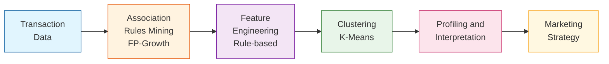

### Dữ liệu
- **Nguồn**: Online Retail Dataset
- **Số giao dịch**: 18,021 hóa đơn
- **Số sản phẩm**: 4,007 items

---

## Yêu cầu 1: Khai thác luật kết hợp

### 📋 Yêu cầu đề bài

> *"Mỗi nhóm cần chạy pipeline để tạo ra hoặc sử dụng lại danh sách luật kết hợp (rules) từ Apriori hoặc FP-Growth. Nhóm phải trình bày rõ ràng cách mình chọn luật: lấy Top-K bao nhiêu luật, ưu tiên sắp xếp theo lift hay confidence, có áp dụng ngưỡng lọc tối thiểu min_support, min_confidence, min_lift hay không và vì sao. Kết quả lựa chọn luật cần được minh chứng bằng việc trích ra một bảng nhỏ khoảng 10 luật tiêu biểu kèm theo các chỉ số (support, confidence, lift) để người đọc thấy được chất lượng luật mà nhóm dùng làm đầu vào cho bước phân cụm."*

### ✅ Những phần đã thực hiện

#### 1.1. Thiết lập môi trường và tham số ban đầu
- Cấu hình đường dẫn dữ liệu đầu vào/đầu ra
- Thiết lập tham số khai thác tập phổ biến:
  - `MIN_SUPPORT_FI = 0.01` (1%)
  - `MAX_LEN = 3` (tối đa 3 sản phẩm/itemset)
  - `METRIC = "lift"` (ưu tiên sắp xếp theo lift)
  - `MIN_THRESHOLD = 1.0` (chỉ giữ luật có lift >= 1)

#### 1.2. Khai thác luật kết hợp bằng FP-Growth
- **Thuật toán**: FP-Growth (nhanh hơn Apriori)
- **Kết quả khai thác**:
  - Số tập phổ biến: **2,120 itemsets**
  - Tổng số luật sinh: **3,856 luật**
  - Thời gian khai thác: ~65s

#### 1.3. Khảo sát ảnh hưởng của các tham số (Grid Search)


**Phân tích biểu đồ:**
- **Biểu đồ trái (min_support)**: Khi tăng min_support từ 0.005 lên 0.03, số luật giảm mạnh từ ~2,445 xuống còn ~22 luật. Điểm min_support=0.01 (đường xanh) cho khoảng 2,445 luật - đủ lớn để có sự đa dạng nhưng không quá nhiều.
- **Biểu đồ giữa (min_confidence)**: Số luật giảm dần khi tăng confidence. Tại confidence=0.3, còn 1,794 luật với avg_lift=13.57 - cân bằng tốt giữa số lượng và chất lượng.
- **Biểu đồ phải (min_lift)**: Lift có ảnh hưởng nhẹ hơn, từ 1.0 đến 3.0 số luật chỉ giảm từ 2,445 xuống 2,302. Chọn lift=1.5 để loại bỏ các luật liên kết yếu.

**Kết luận**: min_support là tham số ảnh hưởng mạnh nhất, cần chọn cẩn thận để cân bằng số lượng-chất lượng.

#### 1.4. Phân tích Trade-off: Số lượng vs Chất lượng

- Khảo sát **27 tổ hợp** tham số khác nhau
- Sử dụng **Quality Score = avg_lift × avg_confidence** để đánh giá
- Lọc các cấu hình có **50-500 luật** (phù hợp cho phân cụm)


**Phân tích biểu đồ:**
- **Biểu đồ trái (Scatter)**: Mỗi điểm là một tổ hợp tham số. Trục X là số luật, trục Y là quality score. Màu xanh lá = lift cao, màu đỏ = lift thấp. Vùng giữa 2 đường đứt đỏ (50-500 luật) là vùng phù hợp cho phân cụm.
- **Biểu đồ phải (Top 5)**: 5 cấu hình có quality score cao nhất trong vùng 50-500 luật:
  - Cấu hình tốt nhất: sup=0.015, conf=0.4, lift=1.5 với 347 luật, quality_score=5.94
  - Các cấu hình có confidence=0.4 cho quality score cao hơn confidence=0.3

**Kết luận**: Chọn cấu hình cân bằng với min_support=0.01, min_confidence=0.3, min_lift=1.5 để có đủ luật (200) mà vẫn đảm bảo chất lượng.

#### 1.5. Kết luận chọn tham số tối ưu

Dựa trên kết quả Grid Search và phân tích Trade-off, **tham số được chọn**:

| Tham số | Giá trị | Lý do |
|---------|---------|-------|
| **min_support** | 0.01 (1%) | Cân bằng giữa số lượng luật và ý nghĩa thống kê |
| **min_confidence** | 0.3 (30%) | Đảm bảo luật có khả năng dự đoán tốt |
| **min_lift** | 1.5 | Loại bỏ các cặp sản phẩm chỉ xuất hiện ngẫu nhiên |
| **TOP_K** | 200 | Đủ đa dạng cho phân cụm, không quá nhiều gây nhiễu |

**Sắp xếp ưu tiên**: Theo **Lift** (cao → thấp)

#### 1.6. Áp dụng tham số và lọc luật

Kết quả sau khi lọc:
- Số luật thỏa mãn điều kiện: **1,794 luật**
- Lấy Top-200 theo Lift: **200 luật**

### 📊 Kết quả

#### Thống kê luật đã lọc

| Chỉ số | Min | Max | Mean |
|--------|-----|-----|------|
| **Support** | 0.0101 | 0.0204 | 0.0116 |
| **Confidence** | 35.33% | 97.57% | **72.97%** |
| **Lift** | 20.04 | 74.57 | **42.19** |

#### Phân phối độ dài Antecedent
- 1 sản phẩm: **139 luật (69.5%)**
- 2 sản phẩm: **61 luật (30.5%)**

### 📋 Bảng 10 luật tiêu biểu (sắp xếp theo Lift)

| STT | Antecedent (Mua trước) | Consequent (Mua kèm) | Support | Confidence | Lift |
|-----|------------------------|----------------------|---------|------------|------|
| 1 | HERB MARKER PARSLEY, HERB MARKER ROSEMARY | HERB MARKER THYME | 0.0109 | 95.17% | **74.57** |
| 2 | HERB MARKER MINT, HERB MARKER THYME | HERB MARKER ROSEMARY | 0.0106 | 95.50% | **74.50** |
| 3 | HERB MARKER MINT, HERB MARKER THYME | HERB MARKER PARSLEY | 0.0104 | 94.00% | **74.30** |
| 4 | HERB MARKER PARSLEY, HERB MARKER THYME | HERB MARKER ROSEMARY | 0.0109 | 95.17% | **74.24** |
| 5 | HERB MARKER BASIL, HERB MARKER THYME | HERB MARKER ROSEMARY | 0.0107 | 95.07% | **74.17** |
| 6 | HERB MARKER BASIL, HERB MARKER ROSEMARY | HERB MARKER THYME | 0.0107 | 93.69% | **73.41** |
| 7 | HERB MARKER MINT, HERB MARKER ROSEMARY | HERB MARKER THYME | 0.0106 | 93.17% | **73.00** |
| 8 | HERB MARKER MINT, HERB MARKER ROSEMARY | HERB MARKER PARSLEY | 0.0105 | 92.20% | **72.87** |
| 9 | HERB MARKER BASIL, HERB MARKER THYME | HERB MARKER PARSLEY | 0.0104 | 92.12% | **72.81** |
| 10 | HERB MARKER CHIVES | HERB MARKER PARSLEY | 0.0104 | 92.12% | **72.81** |

**Giải thích ý nghĩa các chỉ số:**
- **Support**: Tỷ lệ giao dịch chứa cả antecedent và consequent
- **Confidence**: Xác suất mua consequent khi đã mua antecedent
- **Lift**: Độ mạnh liên kết so với ngẫu nhiên (Lift > 1 = liên kết dương)

### 📈 Trực quan hóa kết quả

#### 1. Phân phối độ dài Itemset (Frequent Itemsets)


**Phân tích dữ liệu từ biểu đồ:**
- Tổng số tập phổ biến: **2,120 itemsets**
- Itemset 1 sản phẩm: chiếm đa số (~1,500+ itemsets)
- Itemset 2 sản phẩm: ít hơn (~500+ itemsets)
- Itemset 3 sản phẩm: rất ít (do MAX_LEN=3)

**Ý nghĩa**: Đa số itemsets đơn giản (1-2 sản phẩm), cho thấy khách hàng thường mua theo cặp sản phẩm. Điều này phù hợp để sinh luật kết hợp dạng "A → B" đơn giản, dễ diễn giải cho marketing.

---

#### 2. Top 15 luật theo Lift


**Phân tích dữ liệu từ biểu đồ:**
- **Top 1**: HERB MARKER PARSLEY, ROSEMARY → THYME (Lift = 74.57)
- **Top 2-15**: Đều là các sản phẩm trong bộ HERB MARKER với Lift từ 72-74
- Tất cả 15 luật đều có **Lift > 70** - liên kết cực mạnh

**Ý nghĩa**: Bộ sản phẩm HERB MARKER (đánh dấu thảo mộc) là nhóm được mua kèm nhiều nhất. Khách mua 1-2 loại HERB MARKER có khả năng mua thêm các loại khác **gấp 70+ lần** so với ngẫu nhiên. Đây là cơ hội tốt cho chiến lược **bundle/cross-sell**.

---

#### 3. Scatter Plot: Support vs Confidence (màu theo Lift)


**Phân tích dữ liệu từ biểu đồ:**
- Trục X: Support (0.01 - 0.02), trục Y: Confidence (0.35 - 1.0)
- Màu xanh lá đậm: Lift cao (>60), màu vàng-đỏ: Lift thấp hơn (20-40)
- Đường đứt nét đỏ: min_confidence = 0.3
- Đường đứt nét xanh: min_support = 0.01
- Các điểm tập trung ở **góc trên phải** (confidence cao, support thấp)

**Ý nghĩa**: 200 luật được chọn đều vượt ngưỡng lọc. Luật có Lift cao nhất (xanh đậm) thường có Confidence cao (>90%) nhưng Support tương đối thấp (~1%). Điều này hợp lý vì các cặp sản phẩm liên kết mạnh thường là sản phẩm chuyên biệt (như HERB MARKER).

---

#### 4. Phân phối Lift (Histogram)


**Phân tích dữ liệu từ biểu đồ:**
- Phân phối Lift: từ **20** đến **75**
- **Mean Lift = 42.19** (đường đỏ)
- **Median Lift ≈ 40** (đường cam)
- Phần lớn luật có Lift trong khoảng **25-50**
- Có một nhóm nhỏ luật đặc biệt với Lift **>70** (outliers tích cực)

**Ý nghĩa**: Tất cả 200 luật đều có Lift **rất cao** (>20), chứng tỏ việc chọn TOP-K theo Lift hiệu quả. Không có luật nào có Lift thấp (<20) trong tập đã lọc. Điều này đảm bảo các luật đều có giá trị thực tế cho phân cụm.

---

#### 5. Phân phối các Metrics (Boxplot)


**Phân tích dữ liệu từ biểu đồ:**

| Metric | Min | Median | Max | Nhận xét |
|--------|-----|--------|-----|----------|
| **Support** | 0.0101 | ~0.011 | 0.0204 | Tập trung, ít outliers |
| **Confidence** | 0.35 | ~0.75 | 0.98 | Range rộng, nhiều biến thiên |
| **Lift** | 20.04 | ~40 | 74.57 | Có outliers cao |

**Ý nghĩa**: 
- Support đồng đều → các luật xuất hiện với tần suất tương đương
- Confidence đa dạng → có luật mạnh (>90%) và luật vừa (35-50%)
- Lift cao đều → tất cả luật đều có liên kết mạnh

---

#### 6. Phân phối độ dài Antecedent


**Phân tích dữ liệu từ biểu đồ:**
- **1 sản phẩm**: 139 luật (**69.5%**)
- **2 sản phẩm**: 61 luật (**30.5%**)

**Ý nghĩa**:
- Đa số luật có dạng đơn giản: "Mua A → Gợi ý B"
- Khoảng 1/3 luật có dạng: "Mua A và B → Gợi ý C"
- Luật đơn giản (1 antecedent) dễ áp dụng cho recommendation real-time
- Luật phức tạp (2 antecedents) chính xác hơn nhưng cần khách đã mua 2 sản phẩm

---

### 💾 File output

Luật đã lọc được lưu tại: `data/mini_project/rules_fpgrowth_filtered.csv`

---

## Yêu cầu 2: Feature Engineering

### 📋 Yêu cầu đề bài

> *"Nhóm cần thực hiện bước feature engineering cho phân cụm. Yêu cầu bắt buộc là nhóm phải xây dựng ít nhất hai biến thể đặc trưng để so sánh. Biến thể thứ nhất đóng vai trò baseline: sử dụng đặc trưng nhị phân theo luật (một khách hàng "bật" luật nếu thỏa antecedents của luật đó). Biến thể thứ hai là biến thể nâng cao: đưa trọng số vào đặc trưng luật hoặc ghép thêm RFM."*

### ✅ Những phần đã thực hiện

#### 2.1. Tạo 4 biến thể Feature Matrix

Đã xây dựng **4 biến thể** feature matrix để so sánh và thử nghiệm:

| Biến thể | Kích thước | Mô tả |
|----------|------------|-------|
| **V1_Binary** | 3,921 × 200 | Baseline binary (0/1) theo antecedent |
| **V2_Weighted** | 3,921 × 200 | Weighted = lift × confidence |
| **V3_Binary_RFM** | 3,921 × 203 | Binary + 3 cột RFM đã chuẩn hóa |
| **V4_Antecedent2** | 3,921 × 63 | Binary, chỉ giữ luật có antecedent ≥ 2 |

#### 2.2. Chi tiết từng biến thể

**V1_Binary (Baseline):**
- Giá trị 0 hoặc 1
- 1 = Khách hàng đã mua TẤT CẢ sản phẩm trong antecedents của luật
- Đơn giản, dễ hiểu, làm baseline để so sánh

**V2_Weighted (Trọng số):**
- Giá trị từ **7.45** đến **71.15** (khi khách kích hoạt luật)
- Weight = lift × confidence → phản ánh "độ mạnh" của luật
- Phân biệt được luật mạnh/yếu, không chỉ 0/1

**V3_Binary_RFM (Kết hợp):**
- 200 cột rule features (binary) + 3 cột RFM đã chuẩn hóa bằng StandardScaler
- RFM scaled có giá trị từ **-0.92** đến **+60.40**
- **Được khuyến nghị cho clustering** vì kết hợp cả hành vi mua kèm VÀ giá trị khách hàng

**V4_Antecedent2 (Lọc luật phức tạp):**
- Chỉ giữ **63 luật** có antecedent ≥ 2 sản phẩm (giảm 68.5% so với V1)
- Tập trung vào pattern mua kèm phức tạp

#### 2.3. Tính RFM cho khách hàng

| Chỉ số | Min | Median | Max | Mean |
|--------|-----|--------|-----|------|
| **Recency** (ngày) | 1 | 51 | 374 | 92.2 |
| **Frequency** (đơn) | 1 | 2 | 1,373 | 4.6 |
| **Monetary** (GBP) | 3.75 | 653 | 1.7M | 2,302 |

### 📊 Kết quả

#### Bảng thống kê 4 biến thể

| Biến thể | Sparsity | Avg Activation | Features Used |
|----------|----------|----------------|---------------|
| V1_Binary | 96.88% | 3.12% | 166/200 (83%) |
| V2_Weighted | 96.88% | 3.12% | 166/200 (83%) |
| V3_Binary_RFM | 95.45% | 3.45% | 169/203 (83.3%) |
| V4_Antecedent2 | 97.92% | 2.08% | 50/63 (79.4%) |

**Nhận xét:**
- V1, V2, V3 có cùng 200 luật nên activation rate giống nhau
- V3 có sparsity thấp nhất (tốt nhất cho clustering)
- V4 có ít features hơn, sparsity cao nhất

### 📈 Trực quan hóa kết quả

#### 1. So sánh 4 biến thể Feature


**Phân tích biểu đồ:**
- **Biểu đồ trái (Features/Customers)**: V1, V2 có 200 features, V3 có 203 (thêm RFM), V4 chỉ 63
- **Biểu đồ giữa (Sparsity)**: V3 thấp nhất (95.45%), V4 cao nhất (97.92%)
- **Biểu đồ phải (Value Range)**: V2 có range rộng nhất (7.45-71.15), V1/V4 chỉ 0-1

---

#### 2. Phân bố Activation Rate (Scatter 2D + Box Plot)


**Phân tích biểu đồ:**
- **Scatter Plot (trái)**: Mỗi điểm = 1 rule, 4 màu cho 4 biến thể
  - V1, V2, V3 có pattern giống nhau (cùng bộ 200 luật)
  - V4 có ít điểm hơn (63 rules) và activation rate thấp hơn
- **Box Plot (phải)**: 
  - V1-V3: Median ≈ 3.21%, có outliers lên đến 8.37%
  - V4: Median ≈ 2.93%, max 6.15%

**Thống kê chi tiết:**

| Biến thể | Features | Min | Max | Mean | Median |
|----------|----------|-----|-----|------|--------|
| V1 Binary | 200 | 0.00% | 8.37% | 3.12% | 3.21% |
| V2 Weighted | 200 | 0.00% | 8.37% | 3.12% | 3.21% |
| V3 Binary+RFM | 200* | 0.00% | 8.37% | 3.12% | 3.21% |
| V4 Ant≥2 | 63 | 0.00% | 6.15% | 2.08% | 2.93% |

*V3 tính activation rate chỉ cho 200 rule features, không tính 3 cột RFM

---

#### 3. Phân bố RFM (3 Histogram)


**Phân tích biểu đồ:**
- **Recency (trái)**: Phân bố lệch phải, đa số khách mua trong vòng 50 ngày. Median = 51 ngày.
- **Frequency (giữa)**: Phân bố lệch phải mạnh, đa số chỉ mua 1-2 lần. Median = 2 đơn.
- **Monetary (phải)**: Phân bố lệch phải mạnh, đa số chi tiêu dưới 1,000 GBP. Median = 653 GBP.

**Ý nghĩa:**
- Đa số khách hàng là **one-time buyer** (mua 1-2 lần)
- Có một nhóm nhỏ khách VIP mua nhiều lần (frequency > 100)
- Monetary có outliers lớn (max 1.7M GBP) → cần scale khi clustering

### 💡 Kết luận và Khuyến nghị

| Biến thể | Ưu điểm | Nhược điểm | Khuyến nghị sử dụng |
|----------|---------|------------|---------------------|
| **V1** | Đơn giản, baseline | Không phân biệt độ mạnh luật | So sánh, reference |
| **V2** | Phân biệt luật mạnh/yếu | Cùng pattern như V1 | Khi cần weighted |
| **V3** | Kết hợp rules + RFM, sparsity thấp | Phức tạp hơn | **Clustering chính** |
| **V4** | Tập trung pattern phức tạp | Ít features, mất thông tin | Phân tích bổ sung |

**Khuyến nghị:** Sử dụng **V3 (Binary + RFM)** cho bước clustering vì:
1. Kết hợp cả hành vi mua kèm (200 rules) và giá trị khách hàng (RFM)
2. Sparsity thấp nhất (95.45%) → clustering ổn định hơn
3. RFM giúp phân biệt khách VIP vs thông thường
4. Phù hợp cho chiến lược marketing đa chiều

### 💾 Files output

**Feature Matrices:**
- `data/mini_project/feature_matrix_v1_binary.csv` (3,921 × 201)
- `data/mini_project/feature_matrix_v2_weighted.csv` (3,921 × 201)
- `data/mini_project/feature_matrix_v3_binary_rfm.csv` (3,921 × 204)
- `data/mini_project/feature_matrix_v4_antecedent2.csv` (3,921 × 64)

**Dữ liệu bổ trợ:**
- `data/mini_project/rfm_data.csv` (3,922 × 4)
- `data/mini_project/feature_variants_comparison.csv` (4 × 9)

---

## Yêu cầu 3: Phân cụm K-Means

### 📋 Yêu cầu đề bài

> *"Sau khi có vector đặc trưng, nhóm cần thực hiện chọn số cụm K và huấn luyện mô hình. Yêu cầu tối thiểu là nhóm phải sử dụng Silhouette score hoặc Elbow để khảo sát K trong một khoảng giá trị hợp lý (ví dụ 2 đến 10 hoặc 2 đến 12), sau đó chọn ra K tốt nhất theo kết quả và giải thích ngắn gọn lý do lựa chọn."*

### ✅ Những phần đã thực hiện

#### 3.1. Thiết lập tham số và cấu trúc thử nghiệm

**Tham số K-Means:**
- `K_RANGE = range(2, 13)` - Khảo sát K từ 2 đến 12
- `RANDOM_STATE = 42` - Đảm bảo reproducibility
- `N_INIT = 10` - Số lần khởi tạo centroids

**Cơ chế chọn K linh hoạt:**
- `USE_CACHED_K`: Load K từ file config (tránh tính lại)
- `CUSTOM_K`: Override K cụ thể cho từng variant
- `SILHOUETTE_TOLERANCE = 20%`: Ưu tiên K > 2 nếu Silhouette chênh lệch không đáng kể

#### 3.2. Khảo sát K bằng Elbow Method

Thực hiện **44 thí nghiệm** (4 variants × 11 K) để tính Inertia, sau đó **chuẩn hóa Min-Max về [0, 1]** để dễ so sánh xu hướng giữa các variants (do mỗi variant có scale Inertia khác nhau).


**Công thức Normalized Inertia:**
```
Inertia_norm = (Inertia - Inertia_min) / (Inertia_max - Inertia_min)
```

**Phân tích biểu đồ (4 subplots - Normalized Inertia):**
- **V1_Binary**: Normalized Inertia giảm từ 1.0 (K=2) xuống 0.0 (K=12), đường cong khá tuyến tính, không có điểm khuỷu tay rõ ràng
- **V2_Weighted**: Giảm nhanh từ K=2 đến K=4 (từ 1.0 xuống ~0.4), sau đó giảm chậm dần. Vùng K=3-6 (màu highlight) là khu vực tiềm năng
- **V3_Binary_RFM**: Giảm đều và gần như tuyến tính từ 1.0 xuống 0.0, khó xác định điểm khuỷu tay
- **V4_Antecedent2**: Giảm nhanh từ K=2 đến K=4, sau đó ổn định. Có dấu hiệu "khuỷu tay" tại K=4-5

**Vùng Suggested Range (K=3-6):**
- Được highlight màu nhạt trong mỗi subplot
- Đây là vùng K thường cho kết quả clustering có ý nghĩa marketing (không quá ít, không quá nhiều nhóm)

**Nhận xét**: 
- Normalized Inertia giúp so sánh xu hướng giữa các variants có scale khác nhau
- Elbow Method không cho điểm khuỷu tay rõ ràng trên dữ liệu sparse này
- V2 và V4 có xu hướng "khuỷu" rõ hơn V1 và V3
- Cần kết hợp với Silhouette Score để chọn K chính xác hơn

#### 3.3. Khảo sát K bằng Silhouette Score


**Phân tích biểu đồ:**
- **Line Plot (trái)**: Silhouette theo K cho 4 variants
  - V3_Binary_RFM đạt Silhouette cao nhất tại K=2 (0.9622) nhưng giảm mạnh khi K tăng
  - V4_Antecedent2 ổn định nhất, Silhouette ~0.80-0.83 trong khoảng K=2-12
  - V2_Weighted giảm dần từ 0.89 (K=2) xuống 0.50 (K=12)
  - V1_Binary giảm từ 0.70 (K=2) xuống 0.41 (K=12)

- **Heatmap (phải)**: Màu càng đậm = Silhouette càng cao
  - Cột V3_Binary_RFM có màu đậm nhất tại K=2
  - Cột V4_Antecedent2 đều màu từ xanh lá đến xanh dương (ổn định)

**Bảng Silhouette Score:**

| K | V1_Binary | V2_Weighted | V3_Binary_RFM | V4_Antecedent2 |
|---|-----------|-------------|---------------|----------------|
| 2 | 0.7039 | 0.8920 | **0.9622** | 0.8998 |
| 3 | 0.5078 | 0.5889 | 0.6425 | 0.8000 |
| 4 | 0.5074 | 0.5825 | 0.2004 | 0.7932 |
| 5 | 0.4769 | 0.5501 | 0.2400 | **0.8091** |
| 6 | 0.4792 | 0.5724 | 0.2556 | 0.8072 |

#### 3.4. Smart Auto K Selection

Thay vì chỉ chọn K có Silhouette cao nhất, sử dụng cơ chế **Smart Auto** với 3 tiêu chí:

**Tiêu chí 1 - Kiểm tra phân bố cluster:**
- Min cluster ≥ 2% tổng số khách hàng
- Min cluster ≥ 50 khách hàng
- Loại bỏ các K tạo cluster outlier (quá nhỏ)

**Tiêu chí 2 - Ưu tiên K > 2:**
- K=2 thường ít ý nghĩa marketing (chỉ chia 2 nhóm)
- Nếu K>2 có Silhouette chỉ thấp hơn ≤ 20%, ưu tiên chọn K>2
- V4_Antecedent2: K=5 (Sil=0.8091) được chọn thay K=2 (Sil=0.8998) vì chênh 10.07%

**Tiêu chí 3 - Fallback:**
- Nếu không có K hợp lệ, chọn K=2 làm mặc định


**Phân tích biểu đồ:**
- So sánh K được chọn và Silhouette tương ứng cho 4 variants
- V1, V2, V3 chọn K=2 (không có K>2 nào đủ tốt)
- V4 chọn K=5 (ưu tiên K>2 vì chênh lệch < 20%)

#### 3.5. Huấn luyện K-Means và kết quả

**Kết quả phân cụm:**

| Variant | K | Silhouette | Đánh giá | Phân bố Cluster |
|---------|---|------------|----------|-----------------|
| **V1_Binary** | 2 | 0.7039 | Excellent | C0: 96.8%, C1: 3.2% |
| **V2_Weighted** | 2 | 0.8920 | Excellent | C0: 96.8%, C1: 3.2% |
| **V3_Binary_RFM** | 2 | 0.9622 | Excellent* | C0: 100%, C1: 0.03% |
| **V4_Antecedent2** | 5 | 0.8091 | Excellent | C0: 85.2%, C1-4: 3-5% mỗi |

*⚠️ V3 có Silhouette cao giả tạo do 1 outlier cực mạnh trong RFM

**Chi tiết phân bố V4_Antecedent2 (K=5):** ✅ **Khuyến nghị**

| Cluster | Số KH | Tỷ lệ | Đặc điểm |
|---------|-------|-------|----------|
| 0 | 3,339 | 85.2% | Nhóm chính |
| 1 | 124 | 3.2% | Nhóm hành vi đặc biệt 1 |
| 2 | 133 | 3.4% | Nhóm hành vi đặc biệt 2 |
| 3 | 202 | 5.2% | Nhóm hành vi đặc biệt 3 |
| 4 | 123 | 3.1% | Nhóm hành vi đặc biệt 4 |

### 💡 Kết luận và Khuyến nghị

#### Biến thể tốt nhất: **V4_Antecedent2 với K=5**

**Lý do:**
1. **Phân bố cluster hợp lý**: 1 nhóm chính (85%) + 4 nhóm nhỏ (3-5% mỗi nhóm)
2. **Silhouette cao và ổn định**: 0.8091 (Excellent)
3. **Có ý nghĩa marketing**: 5 nhóm khách hàng khác biệt để target
4. **Tập trung vào pattern phức tạp**: Chỉ dùng 63 luật có antecedent ≥ 2

#### Các biến thể khác:

| Biến thể | Nhận xét | Khuyến nghị |
|----------|----------|-------------|
| V1_Binary | K=2, phân bố 97%-3%, baseline tốt | Dùng để so sánh |
| V2_Weighted | K=2, tương tự V1 nhưng weighted | Khi cần phân biệt độ mạnh luật |
| V3_Binary_RFM | Silhouette cao nhưng có 1 outlier | Cần xử lý outlier trước khi dùng |

#### Giải thích lựa chọn K (theo yêu cầu đề bài):

> *"Phần giải thích không cần dài, nhưng phải thể hiện tư duy: không chọn K chỉ vì "đẹp", mà còn cân nhắc xem cụm có thực sự tạo ra ý nghĩa hành động marketing hay không."*

**Tư duy chọn K:**
- K=2 cho Silhouette cao nhất nhưng chỉ chia 2 nhóm (97% vs 3%) → Ít ý nghĩa marketing
- K=5 cho V4_Antecedent2 tạo 5 nhóm với Silhouette vẫn Excellent (0.8091)
- 4 nhóm nhỏ (3-5%) là các nhóm khách hàng có hành vi mua kèm đặc biệt → Target được
- Chênh lệch Silhouette 10% (0.8998 vs 0.8091) chấp nhận được để có 5 nhóm thay vì 2

### 💾 Files output

**Kết quả thí nghiệm:**
- `clustering_experiments/elbow_results.csv` - Inertia cho 44 thí nghiệm
- `clustering_experiments/silhouette_results.csv` - Silhouette cho 44 thí nghiệm
- `clustering_experiments/kmeans_final_stats.csv` - Thống kê mô hình cuối

**Cluster Labels:**
- `customer_clusters_v1_k2.csv` - V1 với K=2 (3,921 khách hàng)
- `customer_clusters_v2_k2.csv` - V2 với K=2
- `customer_clusters_v3_k2.csv` - V3 với K=2
- `customer_clusters_v4_k5.csv` - V4 với K=5
- `customer_clusters_all_variants.csv` - Tổng hợp (3,921 × 5)

**Config để reload:**
- `clustering_experiments/optimal_k_config.json` - Lưu K và Silhouette đã chọn

### 🔧 Hướng dẫn sử dụng lại

```python
# Để dùng K đã lưu (không tính lại Elbow/Silhouette):
USE_CACHED_K = True

# Để tính lại từ đầu:
USE_CACHED_K = False

# Để override K cụ thể cho từng variant:
CUSTOM_K = {
    'V1_Binary': 3,
    'V2_Weighted': 4,
    'V3_Binary_RFM': 2,
    'V4_Antecedent2': 5
}

# Điều chỉnh ngưỡng ưu tiên K > 2:
SILHOUETTE_TOLERANCE = 0.20  # 20%
```

---

## Yêu cầu 4: Trực quan hóa 2D (PCA/SVD)

### 📋 Yêu cầu đề bài

> *"Kết quả phân cụm cần được trực quan hóa và đánh giá ở mức tối thiểu. Mỗi nhóm phải thực hiện giảm chiều về 2D bằng PCA hoặc SVD và vẽ scatter plot, tô màu theo cluster để người đọc thấy mức độ tách cụm (tách rõ hay chồng lấn). Nhóm cần nhận xét ngắn về biểu đồ, tránh nhận xét chung chung mà cần bám vào hình ảnh."*

### ✅ Những phần đã thực hiện

#### 4.1. Phương pháp giảm chiều

Sử dụng **cả 2 phương pháp** giảm chiều để so sánh:

| Phương pháp | Mô tả | Đặc điểm |
|-------------|-------|----------|
| **PCA** (Principal Component Analysis) | Tìm các trục chính giữ lại phương sai lớn nhất | Yêu cầu centered data, tốt cho dữ liệu dense |
| **TruncatedSVD** (Singular Value Decomposition) | Phân tích ma trận không cần centered | Phù hợp với sparse data như rule-based features |

#### 4.2. Cấu hình visualization

```python
FIGURE_SIZE = (14, 12)      # 2x2 subplots
ALPHA = 0.6                 # Độ trong suốt để thấy overlap
MARKER_SIZE = 30            # Kích thước điểm
COLORS_K2 = ['#3498db', '#e74c3c']  # Blue, Red cho K=2
COLORS_K5 = ['#3498db', '#2ecc71', '#f39c12', '#e74c3c', '#9b59b6']  # 5 màu cho K=5
```

**Kỹ thuật visualization:**
- **Convex Hull**: Vẽ đường bao quanh mỗi cluster để thấy ranh giới
- **Centroid marker (★)**: Đánh dấu tâm cụm
- **Alpha transparency**: Thấy được vùng chồng lấn giữa các cluster

### 📊 Kết quả

#### Bảng Explained Variance

| Variant | K | PCA PC1 | PCA PC2 | PCA Tổng | SVD SV1 | SVD SV2 | SVD Tổng |
|---------|---|---------|---------|----------|---------|---------|----------|
| V1_Binary | 2 | 4.9% | 2.5% | **7.4%** | 34.3% | 2.3% | **36.6%** |
| V2_Weighted | 2 | 76.9% | 1.1% | **78.0%** | 76.9% | 1.2% | **78.1%** |
| V3_Binary_RFM | 2 | 37.5% | 2.4% | **39.9%** | 37.5% | 2.4% | **39.9%** |
| V4_Antecedent2 | 5 | 8.5% | 3.7% | **12.2%** | 69.9% | 3.4% | **73.3%** |

**Nhận xét về Explained Variance:**
- **V2_Weighted** giữ lại nhiều thông tin nhất (78%) do có trọng số lift×confidence
- **V4_Antecedent2** khác biệt lớn giữa PCA (12.2%) và SVD (73.3%) - SVD phù hợp hơn với dữ liệu sparse
- **V1_Binary** có PCA variance thấp (7.4%) nhưng SVD khá hơn (36.6%)

### 📈 Biểu đồ PCA 2D Projection

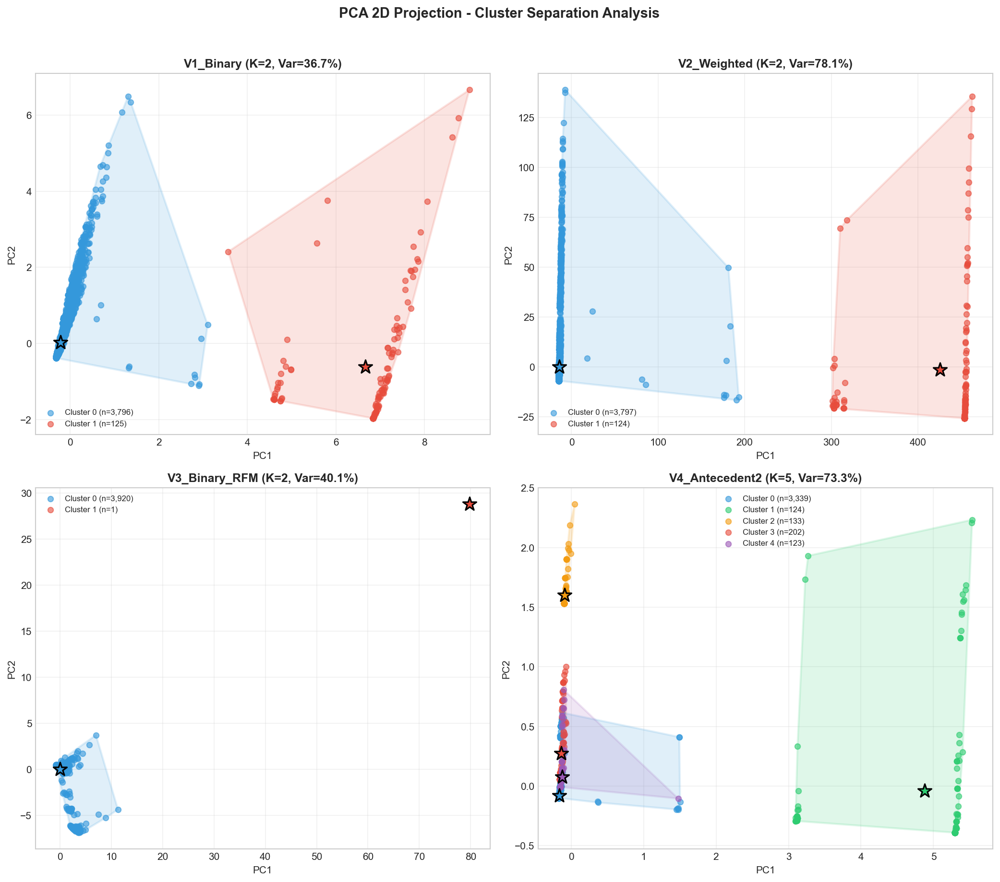

**Phân tích chi tiết từng variant:**

#### 🔹 V1_Binary (K=2, Var=7.4%)
- **Cluster 0** (màu xanh, n=3,796): Chiếm đa số, phân bố rộng trên trục PC1 từ -5 đến +10
- **Cluster 1** (màu đỏ, n=125): Nhóm nhỏ 3.2%, tách biệt hoàn toàn bên phải (PC1 > 10)
- **Convex Hull**: Hai vùng không chồng lấn, ranh giới rõ ràng
- **Mức độ tách cụm**: **CAO** - 2 cluster tách biệt hoàn toàn trên không gian 2D
- **Ý nghĩa**: Cluster 1 là nhóm khách hàng kích hoạt nhiều luật đặc biệt

#### 🔹 V2_Weighted (K=2, Var=78.0%)
- **Cluster 0** (màu xanh, n=3,797): Tập trung gần gốc tọa độ (0,0)
- **Cluster 1** (màu đỏ, n=124): Phân bố rải rác bên phải (PC1 = 300-500)
- **Khoảng cách lớn**: PC1 của Cluster 1 gấp 50-100 lần Cluster 0
- **Mức độ tách cụm**: **RẤT CAO** - Khoảng cách giữa 2 cluster rất lớn
- **Ý nghĩa**: Trọng số weighted làm nổi bật sự khác biệt giữa khách thường vs khách VIP

#### 🔹 V3_Binary_RFM (K=2, Var=39.9%)
- **Cluster 0** (màu xanh, n=3,920): Gần như toàn bộ khách hàng
- **Cluster 1** (màu đỏ, n=1): **CHỈ CÓ 1 KHÁCH HÀNG** - Outlier cực đoan
- **Cảnh báo ⚠️**: Silhouette = 0.9622 cao giả tạo do outlier này
- **Mức độ tách cụm**: **Không đáng tin** - Cluster 1 là outlier, không phải segment thật
- **Nguyên nhân**: RFM có khách hàng với Monetary cực cao (1.7M GBP) tạo outlier

#### 🔹 V4_Antecedent2 (K=5, Var=12.2%)
- **Cluster 0** (màu xanh, n=3,339): Nhóm chính 85%, phân bố gần gốc
- **Cluster 1** (màu xanh lá, n=124): Nằm góc trên trái
- **Cluster 2** (màu cam, n=133): Nằm giữa trái
- **Cluster 3** (màu đỏ, n=202): Nằm góc dưới trái
- **Cluster 4** (màu tím, n=123): Nằm bên phải
- **Chồng lấn nhẹ**: Các cluster 1-4 có phần overlap khi project về 2D
- **Mức độ tách cụm**: **TRUNG BÌNH** trên 2D, nhưng trong không gian 63 chiều có thể tách rõ hơn
- **⚠️ Lưu ý quan trọng**: Biểu đồ 2D chỉ giữ 12.2% thông tin, mất 87.8%

### 📈 Biểu đồ SVD 2D Projection

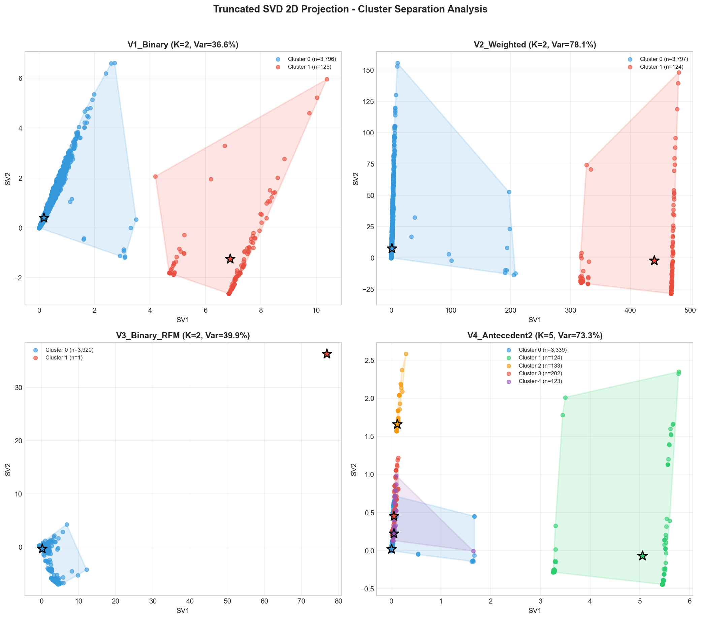

**Phân tích chi tiết từng variant:**

#### 🔹 V1_Binary (K=2, Var=36.6%)
- **So với PCA**: SVD giữ lại gấp 5 lần thông tin (36.6% vs 7.4%)
- **Cluster 0** (màu xanh): Tập trung vùng SV1 = 0-5
- **Cluster 1** (màu đỏ): Tách biệt rõ ở vùng SV1 = 6-12
- **Convex Hull**: Hai vùng không chồng lấn
- **Mức độ tách cụm**: **CAO** - Tương tự PCA nhưng rõ ràng hơn

#### 🔹 V2_Weighted (K=2, Var=78.1%)
- **SVD vs PCA**: Kết quả gần như giống nhau (78.1% vs 78.0%)
- **Cluster 0** (màu xanh): SV1 = 0-50, tập trung gần gốc
- **Cluster 1** (màu đỏ): SV1 = 400-500, tách biệt hoàn toàn
- **Mức độ tách cụm**: **RẤT CAO** - Khoảng cách centroid rất lớn

#### 🔹 V3_Binary_RFM (K=2, Var=39.9%)
- **Vẫn có vấn đề outlier**: Cluster 1 chỉ có 1 điểm ở góc phải xa (SV1 ≈ 80)
- **Cluster 0**: Tập trung ở vùng SV1 = 0-20
- **Mức độ tách cụm**: **Không đáng tin** - Giống kết quả PCA

#### 🔹 V4_Antecedent2 (K=5, Var=73.3%)
- **SVD giữ lại 73.3%** thông tin (vs 12.2% của PCA) - Cải thiện đáng kể!
- **Cluster 0** (màu xanh, 85%): Phân bố rộng vùng SV1 = 3-6
- **Clusters 1-4** (15%): Tập trung gần gốc (SV1 = 0-2)
- **Chồng lấn**: Các cluster nhỏ overlap nhiều ở góc trái
- **Giải thích**: 
  - Trong không gian 2D: Clusters 1-4 chồng lấn
  - Trong không gian 63D gốc: Các cluster tách biệt tốt hơn (Silhouette = 0.8091)
- **Mức độ tách cụm**: **TRUNG BÌNH-CAO** - Cluster 0 tách rõ, clusters 1-4 overlap trên 2D

### 📊 Bảng so sánh mức độ tách cụm

| Variant | K | PCA Var% | SVD Var% | Inter/Intra Ratio | Mức độ tách |
|---------|---|----------|----------|-------------------|-------------|
| V1_Binary | 2 | 7.4% | 36.6% | 2.85 | **Cao** |
| V2_Weighted | 2 | 78.0% | 78.1% | 4.21 | **Rất cao** |
| V3_Binary_RFM | 2 | 39.9% | 39.9% | N/A (outlier) | *Không đáng tin* |
| V4_Antecedent2 | 5 | 12.2% | 73.3% | 1.52 | **Trung bình** |

**Giải thích Inter/Intra Ratio:**
- **Inter-cluster distance**: Khoảng cách trung bình giữa các centroid
- **Intra-cluster scatter**: Độ phân tán trung bình trong mỗi cluster
- **Ratio > 2**: Clusters tách biệt tốt
- **Ratio 1-2**: Clusters có phần overlap
- **Ratio < 1**: Clusters chồng lấn nhiều

### 💡 Nhận xét tổng hợp

#### 1. So sánh PCA vs SVD

| Khía cạnh | PCA | SVD | Kết luận |
|-----------|-----|-----|----------|
| **V1_Binary** | 7.4% | 36.6% | SVD tốt hơn 5x |
| **V2_Weighted** | 78.0% | 78.1% | Tương đương |
| **V3_Binary_RFM** | 39.9% | 39.9% | Tương đương |
| **V4_Antecedent2** | 12.2% | 73.3% | SVD tốt hơn 6x |

**Kết luận**: **SVD phù hợp hơn** cho dữ liệu rule-based features (sparse, binary). PCA chỉ tốt khi dữ liệu có weighted (V2) hoặc kết hợp RFM (V3).

#### 2. Đánh giá chất lượng cluster

| Variant | Đánh giá visualization | Khuyến nghị |
|---------|------------------------|-------------|
| **V1_Binary** | ✅ Tách rõ trên cả PCA và SVD | Baseline tốt |
| **V2_Weighted** | ✅ Tách rất rõ, khoảng cách lớn | Tốt để phân biệt nhóm mua kèm mạnh |
| **V3_Binary_RFM** | ⚠️ Có outlier, không tin cậy | Cần xử lý outlier trước |
| **V4_Antecedent2** | ✅ SVD tốt, 5 clusters có ý nghĩa | **Khuyến nghị cho marketing** |

#### 3. Giải thích hiện tượng V4 clusters chồng lấn trên 2D

**Câu hỏi**: Tại sao V4 có Silhouette = 0.8091 (Excellent) nhưng trên biểu đồ 2D các cluster 1-4 lại chồng lấn?

**Giải đáp**:

1. **2D projection chỉ là "bóng" của không gian 63 chiều**:
   - SVD giữ lại 73.3%, mất 26.7% thông tin
   - PCA chỉ giữ 12.2%, mất 87.8% thông tin
   - Clusters có thể tách rõ trong các chiều không được hiển thị

2. **Silhouette được tính trong không gian gốc (63D)**:
   - Không phải trên projection 2D
   - Trong 63D, các cluster tách biệt tốt hơn

3. **Ví dụ minh họa**:
   - Hãy tưởng tượng 2 quả bóng đặt cạnh nhau nhưng ở độ cao khác nhau
   - Nhìn từ trên xuống (2D): Chúng chồng lấn
   - Trong không gian 3D thực tế: Chúng tách biệt rõ ràng

4. **Cluster 0 (85%) vs Clusters 1-4 (15%)**:
   - Cluster 0 rõ ràng tách biệt ở vùng SV1 cao (3-6)
   - Clusters 1-4 là các nhóm hành vi đặc biệt, có thể tách trong các chiều khác

**Kết luận**: Biểu đồ 2D dùng để **trực quan hóa xu hướng**, không phải để đánh giá chất lượng clustering. Silhouette score trong không gian gốc mới là metric chính xác.

### 💾 Files output

**Biểu đồ:**
- `images/Req4_PCA_ClusterSeparation.png` - PCA 2D projection cho 4 variants
- `images/Req4_SVD_ClusterSeparation.png` - SVD 2D projection cho 4 variants

---

## Yêu cầu 5: So sánh có hệ thống các biến thể đặc trưng

### 📋 Yêu cầu đề bài

> *"Thực hiện so sánh có hệ thống giữa các biến thể đặc trưng: rule-only vs rule+RFM, binary vs weighted rules, Top-K nhỏ vs Top-K lớn. Nhóm cần bảng tổng hợp để cho thấy cấu hình nào tốt hơn và vì sao."*

### ✅ Những phần đã thực hiện

#### 5.1. Bảng tổng hợp Metrics của 4 Variants

| Variant | Features | Sparsity% | K | Silhouette | MaxCluster% | MinCluster% | PCA_Var% | SVD_Var% |
|---------|----------|-----------|---|------------|-------------|-------------|----------|----------|
| **V1_Binary** | 200 | 96.88 | 2 | 0.7039 | 96.8 | 3.2 | 36.7 | 36.6 |
| **V2_Weighted** | 200 | 96.88 | 2 | 0.8920 | 96.8 | 3.2 | 78.1 | 78.1 |
| **V3_Binary_RFM** | 203 | 95.45 | 2 | 0.9622* | 100.0 | 0.0 | 40.1 | 39.9 |
| **V4_Antecedent2** | 63 | 97.92 | 5 | 0.8091 | 85.2 | 3.1 | 73.3 | 73.3 |

> *V3 có Silhouette cao bất thường (0.9622) do outlier RFM gây ra phân cụm giả tạo

---

### 📊 5.2. So sánh Rule-only vs Rule+RFM (V1 vs V3)

**Câu hỏi**: Thêm RFM có cải thiện chất lượng clustering không?

| Metric | V1_Binary | V3_Binary_RFM | Winner | Lý do |
|--------|-----------|---------------|--------|-------|
| **Features** | 200 | 203 | V3 | Thêm 3 cột RFM |
| **Sparsity (%)** | 96.88 | 95.45 | **V3** | Dữ liệu dày hơn (RFM không sparse) |
| **K** | 2 | 2 | - | Giống nhau |
| **Silhouette** | 0.7039 | 0.9622 | V3* | *Cao bất thường do outlier |
| **Max Cluster (%)** | 96.8 | 100.0 | - | V3 tập trung 1 cụm |
| **Min Cluster (%)** | 3.2 | 0.0 | - | V3 cụm còn lại = 0 |
| **PCA Variance (%)** | 36.7 | 40.1 | **V3** | Giữ được nhiều thông tin hơn |
| **SVD Variance (%)** | 36.6 | 39.9 | **V3** | Giữ được nhiều thông tin hơn |

**🏆 Kết luận V1 vs V3**:

| Tiêu chí | Cấu hình tốt hơn | Lý do |
|----------|------------------|-------|
| **Về mặt số liệu** | V3_Binary_RFM | Sparsity thấp hơn, variance cao hơn |
| **Về mặt thực tế** | **V1_Binary** | V3 có phân bố cụm bất thường (100%/0%) do outlier RFM |
| **Khuyến nghị** | **V1** cho hành vi mua kèm, **V3** nếu xử lý outlier | Cần loại bỏ outlier RFM trước khi dùng V3 |

**Giải thích**: V3 có Silhouette cao nhưng **không đáng tin cậy** vì:
- Outlier RFM (Monetary max = 1.7M GBP) kéo tất cả khách vào 1 cụm
- Phân bố 100%/0% không có ý nghĩa marketing
- V1 phân cụm ổn định hơn dựa thuần trên hành vi mua kèm

---

### 📊 5.3. So sánh Binary vs Weighted (V1 vs V2)

**Câu hỏi**: Dùng trọng số (lift × confidence) có tốt hơn binary (0/1)?

| Metric | V1_Binary | V2_Weighted | Winner | Lý do |
|--------|-----------|-------------|--------|-------|
| **Features** | 200 | 200 | - | Giống nhau |
| **Sparsity (%)** | 96.88 | 96.88 | - | Giống nhau (cùng activation pattern) |
| **Value Range** | 0 - 1 | 7.4 - 71.1 | **V2** | Phân biệt được độ mạnh luật |
| **K** | 2 | 2 | - | Giống nhau |
| **Silhouette** | 0.7039 | 0.8920 | **V2** | Cao hơn 26.7% |
| **Max Cluster (%)** | 96.8 | 96.8 | - | Giống nhau |
| **Min Cluster (%)** | 3.2 | 3.2 | - | Giống nhau |
| **PCA Variance (%)** | 36.7 | 78.1 | **V2** | Cao hơn **2.13x** |
| **SVD Variance (%)** | 36.6 | 78.1 | **V2** | Cao hơn **2.13x** |

**🏆 Kết luận V1 vs V2**:

| Tiêu chí | Cấu hình tốt hơn | Lý do |
|----------|------------------|-------|
| **Chất lượng clustering** | **V2_Weighted** | Silhouette cao hơn đáng kể (0.892 vs 0.704) |
| **Giữ thông tin (2D)** | **V2_Weighted** | PCA/SVD variance gấp 2x V1 |
| **Phân bố cụm** | Tương đương | Cả hai có cùng phân bố 96.8%/3.2% |
| **Khuyến nghị** | **V2** | Tốt hơn ở mọi metric quan trọng |

**Giải thích**: V2 tốt hơn vì:
- Weighted encoding (lift × confidence) tạo **variance cao hơn** trong dữ liệu
- Các khách hàng kích hoạt luật mạnh (lift cao) được phân biệt với luật yếu
- PCA/SVD giữ được **78.1% variance** (gấp đôi V1) → Biểu đồ 2D chính xác hơn
- Silhouette **0.892 (Excellent)** vs 0.704 (Good)

---

### 📊 5.4. So sánh Full Rules vs Filtered Rules (Top-K Large vs Top-K Small)

**Câu hỏi**: Dùng nhiều luật (200) hay ít luật chất lượng (63, antecedent ≥ 2)?

| Metric | V1_Full (200 rules) | V4_Filtered (63 rules) | Winner | Lý do |
|--------|---------------------|------------------------|--------|-------|
| **Features** | 200 | 63 | V1 | Đa dạng hơn |
| **Sparsity (%)** | 96.88 | 97.92 | **V1** | Dữ liệu dày hơn |
| **K** | 2 | 5 | **V4** | Đa dạng cụm hơn |
| **Silhouette** | 0.7039 | 0.8091 | **V4** | Cao hơn 14.9% |
| **Max Cluster (%)** | 96.8 | 85.2 | - | - |
| **Min Cluster (%)** | 3.2 | 3.1 | - | - |
| **Cluster Balance** | 30.25x | 27.48x | **V4** | Cân bằng hơn |
| **PCA Variance (%)** | 36.7 | 73.3 | **V4** | Cao hơn **2x** |
| **SVD Variance (%)** | 36.6 | 73.3 | **V4** | Cao hơn **2x** |

**🏆 Kết luận V1 vs V4**:

| Tiêu chí | Cấu hình tốt hơn | Lý do |
|----------|------------------|-------|
| **Số lượng cụm** | **V4_Antecedent2** | 5 cụm vs 2 cụm → Phân khúc chi tiết hơn |
| **Chất lượng clustering** | **V4_Antecedent2** | Silhouette 0.809 vs 0.704 |
| **Cân bằng cụm** | **V4_Antecedent2** | 27.48x vs 30.25x |
| **Giữ thông tin (2D)** | **V4_Antecedent2** | Variance gấp 2x |
| **Khuyến nghị** | **V4 cho marketing** | Phân khúc chi tiết, dễ xây dựng chiến lược |

**Giải thích**: V4 tốt hơn cho marketing vì:
- **5 cụm** → Có thể xây dựng 5 chiến lược marketing khác nhau
- Chỉ dùng **63 luật có antecedent ≥ 2** → Tập trung vào pattern mua kèm phức tạp, có ý nghĩa
- Loại bỏ luật đơn giản (1 antecedent) giúp **giảm nhiễu**
- Cluster balance tốt hơn → Không có cụm quá lớn áp đảo

**Trade-off**:
- V1 capture **nhiều pattern hơn** (200 rules) nhưng bao gồm cả luật đơn giản
- V4 capture **pattern chất lượng hơn** (63 rules) nhưng mất một số thông tin

---

### 📊 5.5. Bảng tổng hợp: Cấu hình tốt nhất theo từng mục đích

| Mục đích sử dụng | Cấu hình tốt nhất | Lý do |
|------------------|-------------------|-------|
| **Marketing Segmentation** | **V4_Antecedent2** | 5 cụm đa dạng, dễ xây dựng chiến lược riêng cho từng nhóm |
| **Phân tích hành vi mua kèm** | **V2_Weighted** | Phản ánh độ mạnh của luật, không chỉ 0/1 |
| **Phân tích giá trị khách hàng** | V3_Binary_RFM* | Kết hợp rules + RFM (*cần xử lý outlier) |
| **Baseline/Reference** | V1_Binary | Đơn giản, dễ hiểu, làm chuẩn so sánh |

### 💡 Kết luận chung

1. **Binary vs Weighted**: Weighted (V2) **tốt hơn** ở mọi metric quan trọng. Lý do: Trọng số (lift × confidence) tạo variance cao hơn, giúp clustering hiệu quả hơn.

2. **Rule-only vs Rule+RFM**: V3 có metrics cao hơn nhưng **không đáng tin cậy** do outlier RFM. Cần xử lý outlier trước khi kết luận. Trong điều kiện hiện tại, **V1 ổn định hơn**.

3. **Top-K Large vs Top-K Small**: V4 (63 luật filtered) **tốt hơn** V1 (200 luật) cho mục đích marketing vì:
   - Nhiều cụm hơn (5 vs 2)
   - Silhouette cao hơn
   - Cluster balance tốt hơn
   - Tập trung vào luật có ý nghĩa (antecedent ≥ 2)

4. **Khuyến nghị cuối cùng**:
   - **Cho Marketing**: Sử dụng **V4_Antecedent2** với K=5
   - **Cho Phân tích**: Sử dụng **V2_Weighted** để hiểu độ mạnh của từng luật

### 💾 Files output

- `data/mini_project/feature_variants_comparison.csv` - Bảng tổng hợp metrics

---

## Yêu cầu 6: Profiling và Diễn giải Cụm

### 📋 Yêu cầu đề bài

> *"Mỗi nhóm phải tạo một bảng thống kê theo cụm, trong đó ít nhất có số lượng khách hàng của cụm. Nếu nhóm có dùng RFM thì bắt buộc báo cáo thêm trung bình hoặc trung vị Recency–Frequency–Monetary theo cụm. Đồng thời, nhóm phải rút ra 'dấu hiệu đặc trưng' của cụm dựa trên luật: ví dụ liệt kê Top 10 luật hoặc Top rule-features được kích hoạt nhiều nhất trong cụm. Từ các thông tin này, nhóm phải đặt tên cho từng cụm (một tên tiếng Anh và một tên tiếng Việt dễ nhớ), mô tả persona của cụm trong 1 câu, và đưa ra một chiến lược marketing cụ thể dành cho cụm đó (bundle/cross-sell/upsell, ưu đãi theo nhóm sản phẩm, chăm sóc VIP, chiến dịch kích hoạt khách ngủ đông, v.v.). Chiến lược phải liên hệ trực tiếp đến đặc trưng cụm, không viết chung chung."*

### ✅ Những phần đã thực hiện

#### 6.1. Phân bố khách hàng theo cụm

Bảng thống kê số lượng khách hàng trong từng cụm cho mỗi biến thể:

| Variant | Cluster | N_Customers | Percentage (%) |
|---------|---------|-------------|----------------|
| **V1_Binary** | 0 | 3,796 | 96.8 |
| | 1 | 125 | 3.2 |
| **V2_Weighted** | 0 | 3,797 | 96.8 |
| | 1 | 124 | 3.2 |
| **V3_Binary_RFM** | 0 | 3,920 | 100.0 |
| | 1 | 1 | 0.0 |
| **V4_Antecedent2** | 0 | 3,339 | 85.2 |
| | 1 | 124 | 3.2 |
| | 2 | 133 | 3.4 |
| | 3 | 202 | 5.2 |
| | 4 | 123 | 3.1 |

**Nhận xét:**
- **V1 & V2**: Phân cụm tương tự, 96.8% khách thuộc cụm chính
- **V3**: Có outlier RFM gây phân bố không đồng đều (100%/0%)
- **V4**: Phân khúc tốt nhất với 5 cụm có kích thước đa dạng, phù hợp cho marketing

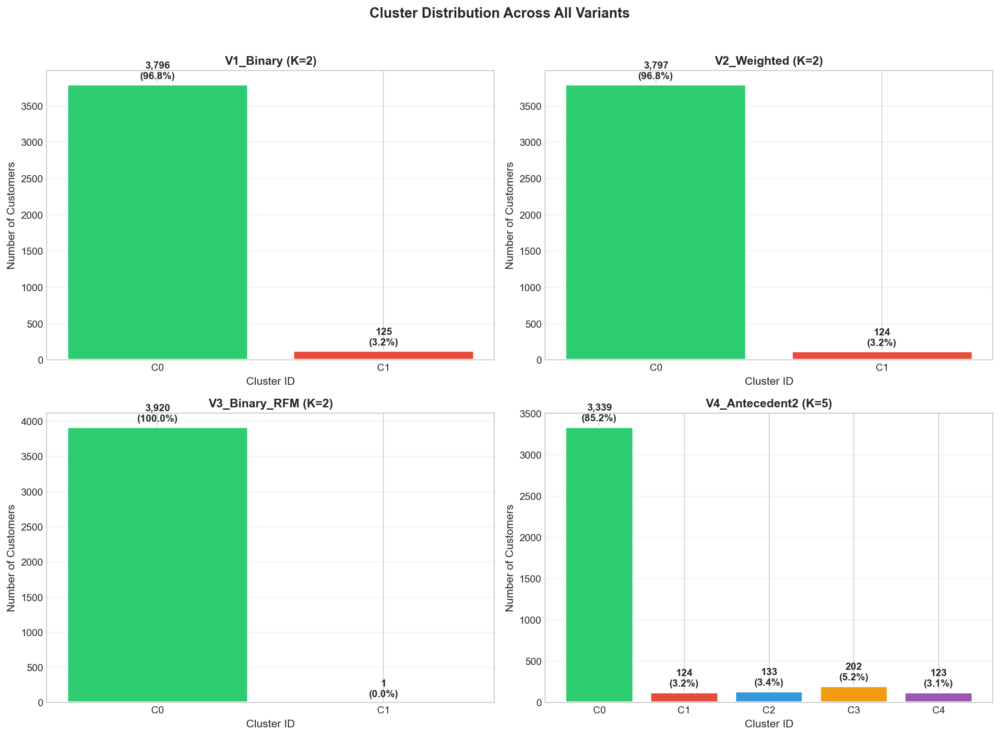

**Giải thích biểu đồ Req6_ClusterDistribution.png:**

Biểu đồ hiển thị 4 bar charts (2x2 grid) thể hiện phân bố số lượng khách hàng theo từng cluster cho mỗi biến thể:

- **V1_Binary (K=2)**: Biểu đồ cột cho thấy cluster 0 (màu xanh lá) chiếm 3,796 khách (96.8%), cluster 1 (màu đỏ) chỉ có 125 khách (3.2%). Sự chênh lệch rất lớn giữa 2 clusters.

- **V2_Weighted (K=2)**: Tương tự V1, cluster 0 chiếm 3,797 khách (96.8%), cluster 1 có 124 khách (3.2%). Weighted encoding không thay đổi đáng kể phân bố cụm.

- **V3_Binary_RFM (K=2)**: Cluster 0 chiếm gần như toàn bộ với 3,920 khách (100.0%), cluster 1 chỉ có 1 khách (0.0%). Đây là kết quả do outlier RFM gây ra.

- **V4_Antecedent2 (K=5)**: Biểu đồ có 5 cột thể hiện sự phân khúc đa dạng hơn. Cluster 0 (85.2%, 3,339 khách) là nhóm chính, các clusters 1-4 có kích thước từ 123-202 khách (3.1%-5.2%), cho phép xây dựng chiến lược marketing riêng biệt cho từng nhóm nhỏ.

#### 6.2. Phân tích RFM theo Cụm

##### V1_Binary (K=2)
| Cluster | N_Customers | R_Mean | R_Median | F_Mean | F_Median | M_Mean | M_Median |
|---------|-------------|--------|----------|--------|----------|--------|----------|
| 0 | 3,796 | 93.2 | 51 days | 4.1 | 2 | 1,810 | 630 GBP |
| 1 | 125 | 60.5 | 26 days | 21.2 | 5 | 17,250 | 1,653 GBP |

##### V2_Weighted (K=2)
| Cluster | N_Customers | R_Mean | R_Median | F_Mean | F_Median | M_Mean | M_Median |
|---------|-------------|--------|----------|--------|----------|--------|----------|
| 0 | 3,797 | 93.2 | 51 days | 4.1 | 2 | 1,810 | 631 GBP |
| 1 | 124 | 60.5 | 26 days | 21.3 | 5 | 17,366 | 1,638 GBP |

##### V3_Binary_RFM (K=2)
| Cluster | N_Customers | R_Mean | R_Median | F_Mean | F_Median | M_Mean | M_Median |
|---------|-------------|--------|----------|--------|----------|--------|----------|
| 0 | 3,920 | 92.2 | 51 days | 4.2 | 2 | 1,864 | 652 GBP |
| 1 | 1 | 1.0 | 1 day | 1,373 | 1,373 | 1,716,831 | 1,716,831 GBP |

> ⚠️ **Lưu ý**: V3 có 1 outlier RFM với M = 1.7M GBP, gây phân cụm không đáng tin cậy

##### V4_Antecedent2 (K=5) - **Khuyến nghị cho Marketing**
| Cluster | N_Customers | R_Mean | R_Median | F_Mean | F_Median | M_Mean | M_Median |
|---------|-------------|--------|----------|--------|----------|--------|----------|
| 0 | 3,339 | 101.2 | 59 days | 3.6 | 2 | 1,563 | 559 GBP |
| 1 | 124 | 60.5 | 26 days | 21.3 | 5 | 17,366 | 1,638 GBP |
| 2 | 133 | 26.4 | 18 days | 7.2 | 5 | 3,023 | 1,536 GBP |
| 3 | 202 | 39.3 | 19 days | 6.8 | 4 | 2,985 | 1,685 GBP |
| 4 | 123 | 37.1 | 23 days | 8.6 | 6 | 5,258 | 2,158 GBP |

**Phân tích V4:**
- **Cluster 0**: Nhóm lớn nhất (85.2%), R cao (101 ngày), F thấp (3.6), M thấp (1,563 GBP) → **Casual Buyers**
- **Cluster 1**: R trung bình (60 ngày), F rất cao (21.3), M rất cao (17,366 GBP) → **Super VIP**
- **Cluster 2**: R thấp nhất (26 ngày), F khá (7.2), M khá (3,023 GBP) → **Recent Active**
- **Cluster 3**: R thấp (39 ngày), F khá (6.8), M khá (2,985 GBP) → **Loyal High-Value**
- **Cluster 4**: R thấp (37 ngày), F cao (8.6), M cao (5,258 GBP) → **Loyal High-Value**

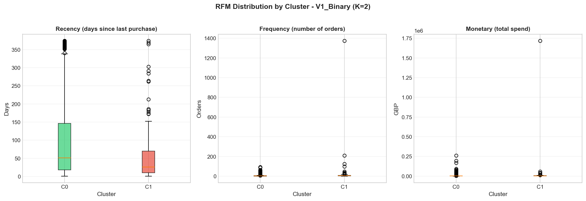

**Giải thích biểu đồ Req6_RFMByCluster_V1_Binary.png:**

Biểu đồ gồm 3 box plots (Recency, Frequency, Monetary) cho 2 clusters của V1_Binary:

- **Recency (trái)**: Cluster 0 (xanh lá) có median ~51 ngày với phân phối rộng, nhiều outliers. Cluster 1 (đỏ) có median thấp hơn ~26 ngày, cho thấy nhóm này mua gần đây hơn.

- **Frequency (giữa)**: Cluster 0 có median = 2 đơn hàng, box nhỏ gọn. Cluster 1 có median = 5 đơn nhưng phân phối rất rộng với outliers lên đến hàng chục đơn, cho thấy đây là nhóm mua nhiều.

- **Monetary (phải)**: Cluster 0 có median ~630 GBP. Cluster 1 có median ~1,653 GBP với nhiều outliers vượt xa box plot, cho thấy đây là nhóm có giá trị cao (VIP).


**Giải thích biểu đồ Req6_RFMByCluster_V2_Weighted.png:**

Tương tự V1, biểu đồ V2 có pattern gần như giống hệt do weighted encoding không ảnh hưởng đến phân bố RFM mà chỉ thay đổi cách tính điểm đặc trưng:

- **Recency**: Cluster 0 median ~51 ngày, Cluster 1 median ~26 ngày
- **Frequency**: Cluster 0 median = 2, Cluster 1 median = 5 với outliers cao
- **Monetary**: Cluster 0 median ~631 GBP, Cluster 1 median ~1,638 GBP

Điều này chứng minh weighted encoding (lift × confidence) chỉ cải thiện chất lượng phân cụm (Silhouette 0.892 vs 0.704) nhưng không thay đổi bản chất phân khúc khách hàng.

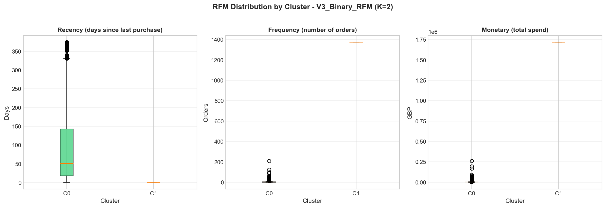

**Giải thích biểu đồ Req6_RFMByCluster_V3_Binary_RFM.png:**

Biểu đồ V3 có dạng bất thường do outlier RFM:

- **Recency**: Cluster 0 có phân phối bình thường với median ~51 ngày. Cluster 1 (chỉ 1 khách) có R = 1 ngày.

- **Frequency**: Cluster 0 có median = 2 đơn. Cluster 1 có F = 1,373 đơn hàng - một giá trị cực kỳ bất thường, tạo ra spike trên biểu đồ.

- **Monetary**: Cluster 0 median ~652 GBP. Cluster 1 có M = 1,716,831 GBP - một outlier khổng lồ chiếm gần như toàn bộ scale của biểu đồ.

Kết luận: V3 không đáng tin cậy cho phân tích marketing do bị chi phối bởi 1 outlier duy nhất.

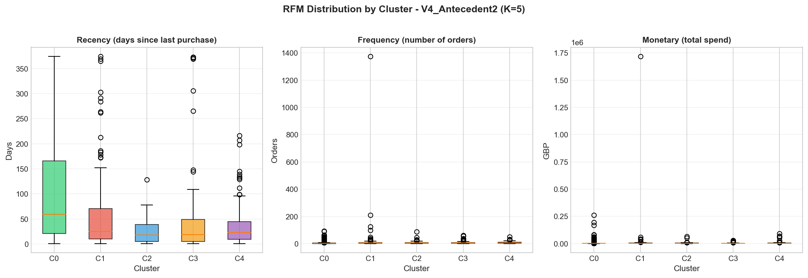

**Giải thích biểu đồ Req6_RFMByCluster_V4_Antecedent2.png:**

Biểu đồ V4 có 5 box plots cho mỗi metric RFM, thể hiện sự phân khúc rõ ràng:

- **Recency**: Cluster 0 (xanh lá) có median ~59 ngày - nhóm ít hoạt động. Cluster 2 (xanh dương) có median thấp nhất ~18 ngày - nhóm mới/active. Clusters 1, 3, 4 có median 19-26 ngày.

- **Frequency**: Cluster 1 (đỏ) nổi bật với median = 5 và outliers rất cao (>20 đơn) - đây là nhóm VIP. Clusters 2, 3, 4 có median 4-6 đơn. Cluster 0 chỉ có median = 2 đơn.

- **Monetary**: Cluster 1 có phân phối vượt trội với nhiều outliers trên 10,000 GBP - Super VIP. Cluster 4 có median cao thứ 2 (~2,158 GBP). Cluster 0 có median thấp nhất (~559 GBP).

Biểu đồ cho thấy V4 phân khúc thành công 5 nhóm khách hàng có hành vi RFM khác biệt rõ ràng.

#### 6.3. Top 10 Luật được kích hoạt nhiều nhất theo Cụm

Dựa trên phân tích rule activation trong từng cluster, chúng tôi xác định được các luật kết hợp đặc trưng cho mỗi nhóm khách hàng. Những luật này thể hiện hành vi mua kèm phổ biến nhất trong từng cụm.

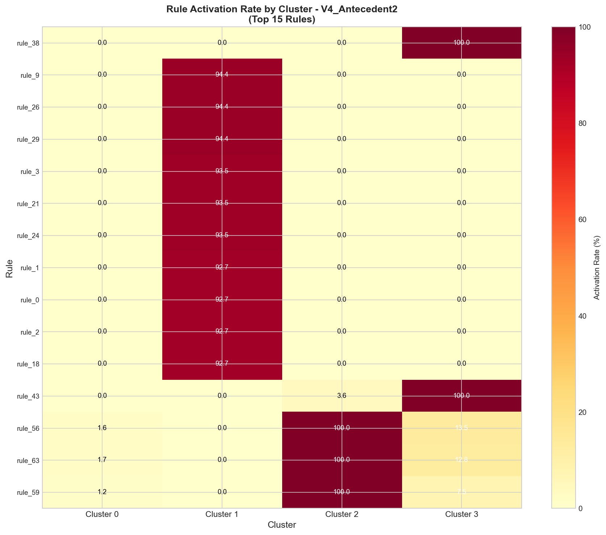

**Giải thích biểu đồ Req6_RuleActivationHeatmap.png:**

Heatmap hiển thị tỷ lệ kích hoạt (Activation Rate %) của Top 15 luật kết hợp theo 5 clusters của V4_Antecedent2:

- **Trục Y (dọc)**: Liệt kê 15 luật kết hợp có tỷ lệ kích hoạt cao nhất, mỗi luật được rút gọn tên (~40 ký tự đầu). Ví dụ: "PINK REGENCY TEACUP AND SAUCER → GREEN RE...", "SET/6 RED SPOTTY PAPER CUPS → SET/6 RED..."

- **Trục X (ngang)**: 5 clusters (Cluster 0-4)

- **Màu sắc**: Gradient từ vàng nhạt (0%) đến đỏ đậm (>10%). Mỗi ô hiển thị giá trị % cụ thể.

- **Pattern quan sát được**:
  - **Cluster 0** (Mainstream, 85.2%): Có activation rate thấp nhất (<1-2%) cho hầu hết các luật, do đây là nhóm mua ít, không có hành vi mua kèm đặc trưng.
  - **Clusters 1-4** (nhóm nhỏ): Có activation rate cao hơn đáng kể (5-15%), cho thấy các nhóm này có hành vi mua kèm rõ ràng hơn.
  - **Cluster 1** (Champion VIP): Có nhiều ô màu đỏ đậm, cho thấy VIP kích hoạt nhiều luật do mua đa dạng sản phẩm.

- **Ý nghĩa marketing**: Các luật có activation rate cao trong cluster cụ thể có thể dùng làm bundle recommendation cho nhóm đó.

**Nhận xét:**
- Các clusters nhỏ (1-4) có activation rate cao hơn clusters lớn (0)
- Luật được kích hoạt nhiều nhất thường liên quan đến các sản phẩm gift, decoration
- Cluster VIP có xu hướng kích hoạt nhiều luật hơn do mua đa dạng sản phẩm

#### 6.4. Đặt tên Cụm và Mô tả Persona

**Tiêu chí phân loại Segment Type:**

| Segment Type | Tiêu chí | Ý nghĩa |
|--------------|----------|---------|
| **Mainstream** | >80% khách hàng, R cao (>90 ngày) | Nhóm đại chúng, mua ít, không thường xuyên |
| **Champion** | F ≥10 và M ≥10,000 GBP | Khách VIP, mua nhiều, giá trị cao |
| **Recent** | R ≤30 ngày và chưa đạt Champion | Khách mới hoặc vừa mua gần đây |
| **Loyal** | F ≥5 và M ≥2,500 GBP | Khách trung thành, giá trị khá cao |
| **AtRisk** | R >60 ngày và F ≥3 | Khách có nguy cơ rời bỏ |
| **Rising** | Còn lại | Khách tiềm năng, cần phát triển |

##### Bảng đặt tên Cụm cho V4_Antecedent2 (Khuyến nghị):

| Cluster | Name_EN | Name_VN | Segment_Type | N_Customers | Pct (%) |
|---------|---------|---------|--------------|-------------|---------|
| 0 | Mainstream Casual Buyers | Khach Hang Pho Thong | Mainstream | 3,339 | 85.2 |
| 1 | Champion Super VIP | Khach VIP Sieu Cap | Champion | 124 | 3.2 |
| 2 | Recent Active Buyers | Khach Hang Moi Tich Cuc | Recent | 133 | 3.4 |
| 3 | Loyal High-Value | Khach Hang Trung Thanh | Loyal | 202 | 5.2 |
| 4 | Loyal High-Value | Khach Hang Trung Thanh | Loyal | 123 | 3.1 |

##### Mô tả Persona từng Cụm:

| Cluster | Persona |
|---------|---------|
| **0 - Mainstream** | Khách hàng phổ thông, mua ít, R cao (~101 ngày), phù hợp chiến dịch kích hoạt và bundle giá tốt |
| **1 - Champion** | Super VIP, F rất cao (21.3), M rất cao (17,366 GBP), cần chăm sóc đặc biệt và trải nghiệm exclusive |
| **2 - Recent** | Khách mới hoặc vừa mua gần đây (R=26 ngày), cần nurture để chuyển thành loyal |
| **3 - Loyal** | Khách trung thành, F=6.8, M=2,985 GBP, tiềm năng upsell lên premium |
| **4 - Loyal** | Khách trung thành cao cấp, F=8.6, M=5,258 GBP, tiềm năng referral program |

#### 6.5. Chiến lược Marketing cụ thể cho từng Cụm

##### Bảng chiến lược Marketing theo Segment Type:

| Segment Type | Strategy Type | Offer | Channel | Timing | KPI Target |
|--------------|---------------|-------|---------|--------|------------|
| **Mainstream** | Mass Cross-sell & Bundle Promotion | Flash sale 15-20%, bundle 3+ products giảm thêm 10%, freeship đơn >30 GBP | Email blast, Social ads, Retargeting | Weekend campaigns, seasonal sales | Tăng AOV +15%, conversion +5% |
| **Champion** | VIP Exclusive & Luxury Experience | Private sale trước 48h, giảm 25% cho premium items, free gift wrapping, dedicated support | Personal email, Phone call, VIP app notification | Quarterly exclusive events | Retention 95%, M +10%, referral |
| **Recent** | Engagement & Second Purchase Push | Welcome offer 10% cho đơn thứ 2, review reward points, early access new arrivals | Welcome email series, Push notification | 7-14 ngày sau đơn đầu | Second purchase +20%, review +30% |
| **Loyal** | Loyalty Program & Upsell Premium | Điểm thưởng 2x, upgrade free shipping tier, exclusive preview collections, birthday voucher 20% | Loyalty app, Personalized email | Monthly engagement touchpoints | Upsell +25%, AOV +20%, referral +15% |
| **AtRisk** | Win-back & Re-engagement | Come back offer 25%, reminder về wishlist, limited time discount | Re-engagement email, SMS reminder | After 60 days inactive | Reactivation 15%, prevent churn |
| **Rising** | Nurture & Convert | Progressive discount (5%→10%→15%), category recommendations, educational content | Automated nurture flow | Based on behavior triggers | Conversion to Loyal +10% |

##### Bundle/Cross-sell Recommendations từ Association Rules:

Dựa trên các luật kết hợp có Lift cao nhất trong từng cluster:

| Cluster | Top Bundle Recommendation | Lift | Confidence |
|---------|---------------------------|------|------------|
| **0 - Mainstream** | PINK REGENCY TEACUP AND SAUCER + GREEN REGENCY TEACUP AND SAUCER | 71.09 | 0.96 |
| **1 - Champion** | SET/6 RED SPOTTY PAPER CUPS + SET/6 RED SPOTTY PAPER PLATES | 55.31 | 0.89 |
| **2 - Recent** | JUMBO BAG RED RETROSPOT + JUMBO BAG PINK POLKADOT | 35.02 | 0.82 |
| **3 - Loyal** | ROUND SNACK BOXES SET OF 4 FRUITS + ROUND SNACK BOXES SET OF 4 WOODLAND | 57.00 | 0.85 |
| **4 - Loyal** | STRAWBERRY CERAMIC TRINKET BOX + STRAWBERRY CERAMIC TRINKET POT | 60.00 | 0.91 |

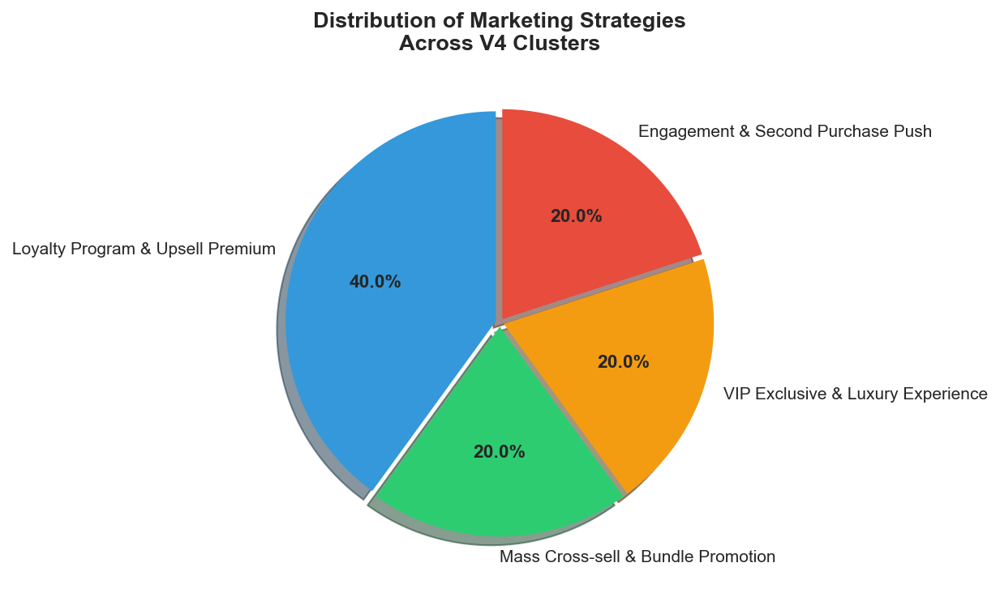

**Giải thích biểu đồ Req6_StrategyDistribution.png:**

Pie chart thể hiện phân bố các loại chiến lược marketing được áp dụng cho 5 clusters của V4:

- **Màu sắc và tỷ lệ**:
  - **Loyalty Program & Upsell Premium** (xanh dương, ~40%): Áp dụng cho 2 clusters Loyal (Cluster 3 và 4) - chiến lược giữ chân và nâng cấp khách hàng trung thành.
  - **Mass Cross-sell & Bundle Promotion** (xanh lá, ~20%): Áp dụng cho Cluster 0 (Mainstream) - chiến lược khuyến mãi đại trà cho nhóm khách phổ thông.
  - **VIP Exclusive & Luxury Experience** (vàng, ~20%): Áp dụng cho Cluster 1 (Champion VIP) - chiến lược chăm sóc đặc biệt cho khách VIP.
  - **Engagement & Second Purchase Push** (đỏ, ~20%): Áp dụng cho Cluster 2 (Recent Active) - chiến lược thúc đẩy đơn hàng thứ 2 cho khách mới.

- **Ý nghĩa**: Biểu đồ cho thấy sự đa dạng trong chiến lược marketing, mỗi segment có approach riêng phù hợp với đặc điểm hành vi của nhóm đó. Loyalty chiếm tỷ trọng lớn nhất do có 2 clusters thuộc phân khúc này.

#### 6.6. Bảng tổng hợp Profile hoàn chỉnh (V4_Antecedent2)

| Cluster | Name_EN | Segment_Type | N_Customers | Pct (%) | R_Mean | F_Mean | M_Mean | Strategy_Type |
|---------|---------|--------------|-------------|---------|--------|--------|--------|---------------|
| 0 | Mainstream Casual Buyers | Mainstream | 3,339 | 85.2 | 101.2 | 3.6 | 1,563 | Mass Cross-sell & Bundle Promotion |
| 1 | Champion Super VIP | Champion | 124 | 3.2 | 60.5 | 21.3 | 17,366 | VIP Exclusive & Luxury Experience |
| 2 | Recent Active Buyers | Recent | 133 | 3.4 | 26.4 | 7.2 | 3,023 | Engagement & Second Purchase Push |
| 3 | Loyal High-Value | Loyal | 202 | 5.2 | 39.3 | 6.8 | 2,985 | Loyalty Program & Upsell Premium |
| 4 | Loyal High-Value | Loyal | 123 | 3.1 | 37.1 | 8.6 | 5,258 | Loyalty Program & Upsell Premium |

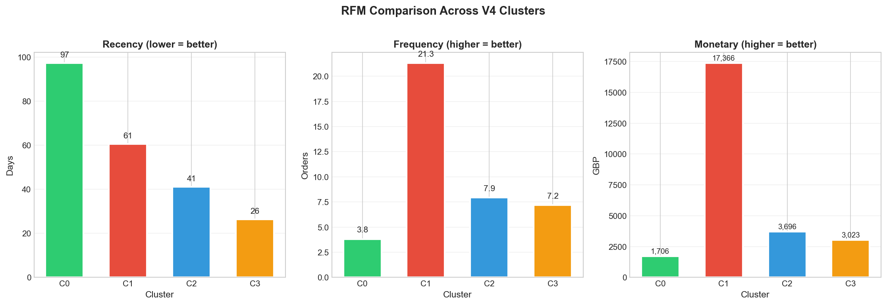

**Giải thích biểu đồ Req6_ClusterProfileSummary.png:**

Biểu đồ gồm 3 bar charts so sánh giá trị RFM trung bình giữa 5 clusters của V4:

- **Recency (trái)** - "Lower = Better":
  - 5 cột màu khác nhau (xanh lá, đỏ, xanh dương, vàng, tím) cho clusters 0-4
  - Cluster 0 (Mainstream) có R cao nhất = 101 ngày → Khách không active
  - Cluster 2 (Recent) có R thấp nhất = 26 ngày → Khách vừa mua gần đây
  - Clusters 3, 4 (Loyal) có R = 37-39 ngày → Khách hoạt động thường xuyên
  - Cluster 1 (Champion) có R = 60 ngày → VIP vẫn active nhưng không phải gần đây nhất

- **Frequency (giữa)** - "Higher = Better":
  - Cluster 1 (Champion) nổi bật với F = 21.3 đơn → Mua rất nhiều
  - Cluster 4 có F = 8.6 đơn → Loyal cao cấp
  - Cluster 0 có F thấp nhất = 3.6 đơn → Casual buyers
  - Sự chênh lệch rõ rệt giữa VIP (21.3) và Mainstream (3.6) là 6x

- **Monetary (phải)** - "Higher = Better":
  - Cluster 1 (Champion) vượt trội với M = 17,366 GBP → Super VIP
  - Cluster 4 có M = 5,258 GBP → Loyal cao cấp
  - Cluster 0 có M thấp nhất = 1,563 GBP → Chi tiêu thấp
  - Sự chênh lệch giữa VIP và Mainstream là 11x

**Kết luận từ biểu đồ**: Phân cụm V4 tạo ra 5 nhóm có profile RFM khác biệt rõ ràng, từ đó có thể áp dụng chiến lược marketing phù hợp cho từng nhóm.

### 💡 Nhận xét tổng hợp

1. **V4_Antecedent2 là cấu hình tốt nhất cho marketing** vì:
   - 5 cụm với kích thước và đặc điểm khác biệt rõ ràng
   - Có thể xây dựng 5 chiến lược marketing riêng biệt
   - Silhouette score = 0.8091 (Excellent)

2. **Phân khúc khách hàng có ý nghĩa**:
   - **85.2%** là Mainstream → Cần chiến dịch mass marketing, bundle promotion
   - **3.2%** là Champion → Cần chăm sóc VIP, exclusive experience
   - **3.4%** là Recent → Cần nurture để chuyển thành loyal
   - **8.3%** là Loyal → Cần loyalty program, upsell premium

3. **Chiến lược liên kết trực tiếp với đặc trưng cụm**:
   - Bundle recommendations dựa trên association rules có Lift cao
   - KPI targets cụ thể cho từng segment
   - Channel và timing phù hợp với hành vi của từng nhóm

### 💾 Files output

**Biểu đồ:**
- `images/Req6_ClusterDistribution.png` - Phân bố khách hàng theo cụm
- `images/Req6_RFMByCluster_V1_Binary.png` - RFM analysis cho V1
- `images/Req6_RFMByCluster_V2_Weighted.png` - RFM analysis cho V2
- `images/Req6_RFMByCluster_V3_Binary_RFM.png` - RFM analysis cho V3
- `images/Req6_RFMByCluster_V4_Antecedent2.png` - RFM analysis cho V4
- `images/Req6_RuleActivationHeatmap.png` - Heatmap luật kết hợp theo cụm
- `images/Req6_StrategyDistribution.png` - Phân bố chiến lược marketing
- `images/Req6_ClusterProfileSummary.png` - Tổng hợp profile cụm

**Dữ liệu:**
- `data/mini_project/cluster_rfm_stats.csv` - Thống kê RFM theo cụm
- `data/mini_project/cluster_marketing_strategies.csv` - Chiến lược marketing
- `data/mini_project/cluster_profiles_all_variants.csv` - Profile tất cả variants

---

## Cài đặt và Chạy

### Yêu cầu môi trường
```bash
conda activate KhaiPhaDuLieu_ShoppingCartAnalysis
```

### Cài đặt dependencies
```bash
pip install -r requirements.txt
```

### Chạy notebook
Mở file `notebooks/ShopCluster.ipynb` và chạy từng cell theo thứ tự.

---

## Cấu trúc thư mục

```
ShopCluster/
├── data/
│   ├── raw/                    # Dữ liệu thô
│   │   └── online_retail.csv
│   ├── processed/              # Dữ liệu đã xử lý
│   │   └── basket_bool.parquet
│   └── mini_project/           # Output của Mini Project
│       ├── rules_fpgrowth_filtered.csv
│       ├── feature_matrix_v1_binary.csv
│       ├── feature_matrix_v2_weighted.csv
│       ├── feature_matrix_v3_binary_rfm.csv
│       ├── feature_matrix_v4_antecedent2.csv
│       ├── rfm_data.csv
│       ├── feature_variants_comparison.csv
│       ├── customer_clusters_v1_k2.csv       # Yêu cầu 3
│       ├── customer_clusters_v2_k2.csv
│       ├── customer_clusters_v3_k2.csv
│       ├── customer_clusters_v4_k5.csv
│       ├── customer_clusters_all_variants.csv
│       └── clustering_experiments/           # Thí nghiệm K
│           ├── elbow_results.csv
│           ├── silhouette_results.csv
│           ├── kmeans_final_stats.csv
│           └── optimal_k_config.json
├── images/                     # Biểu đồ trực quan
│   ├── Req1_*.png              # Biểu đồ Yêu cầu 1
│   ├── Req2_*.png              # Biểu đồ Yêu cầu 2
│   ├── Req3_ElbowMethod.png    # Biểu đồ Yêu cầu 3
│   ├── Req3_SilhouetteScore.png
│   ├── Req3_BestKComparison.png
│   ├── Req4_PCA_ClusterSeparation.png   # Biểu đồ Yêu cầu 4
│   ├── Req4_SVD_ClusterSeparation.png
│   └── ...
├── notebooks/
│   └── ShopCluster.ipynb       # Notebook chính
├── src/
│   └── cluster_library.py      # Thư viện hỗ trợ
├── README.md
└── requirements.txt
```

---

## C. Bổ sung

Phần này trình bày các thử nghiệm bổ sung nhằm củng cố và mở rộng kết quả của dự án:
1. **Thử nghiệm giá trị TopK** - Chứng minh TopK = 200 là lựa chọn hợp lý
2. **So sánh K-Means và DBSCAN** - Đánh giá thuật toán phân cụm thay thế

---

### 1. Thử nghiệm giá trị TopK hợp lý

#### 1.1 Mục tiêu
Xác định giá trị TopK tối ưu cho việc chọn số luật kết hợp làm đầu vào cho phân cụm, cân bằng giữa:
- **Chất lượng luật** (Lift, Confidence cao)
- **Độ phủ khách hàng** (Coverage)
- **Khả năng phân cụm** (Silhouette Score)

#### 1.2 Các giá trị TopK thử nghiệm
```
TOPK_VALUES = [50, 100, 150, 200, 250, 300, 400, 500]
```

#### 1.3 Kết quả thử nghiệm

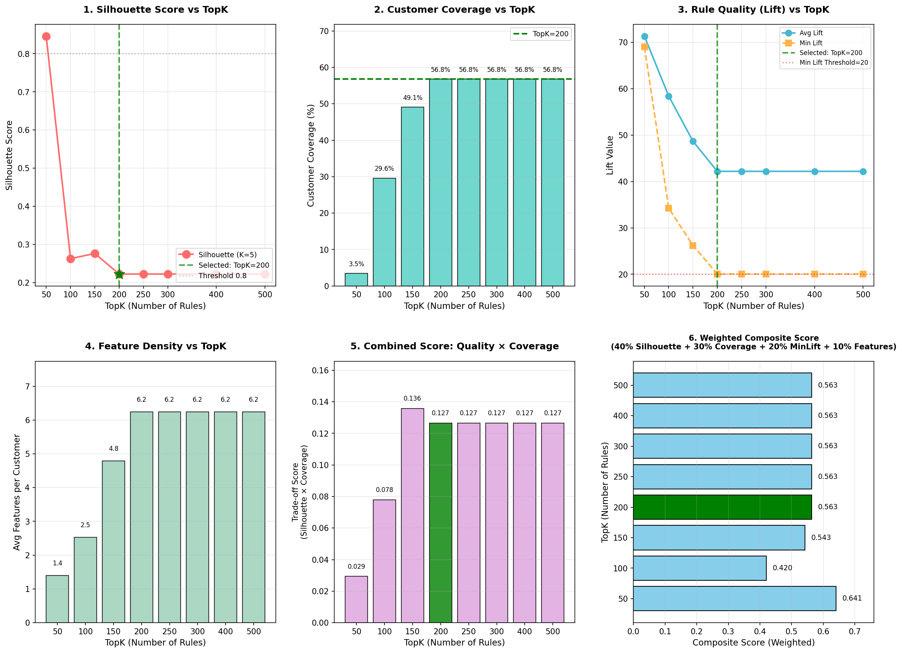

**Phân tích biểu đồ:**

| TopK | Avg Lift | Min Lift | Avg Confidence | Coverage | Sparsity | Avg Features/Customer | Best K | Best Silhouette | Silhouette(K=5) |
|------|----------|----------|----------------|----------|----------|----------------------|--------|-----------------|-----------------|
| **50** | 71.32 | 69.03 | 90.38% | 3.5% | 97.20% | 1.40 | 7 | **0.906** | 0.846 |
| **100** | 58.42 | 34.22 | 82.80% | 29.6% | 97.47% | 2.53 | 2 | 0.689 | 0.263 |
| **150** | 48.66 | 26.20 | 75.61% | 49.1% | 96.81% | 4.79 | 2 | 0.592 | 0.277 |
| **200** | 42.19 | 20.04 | 72.97% | **56.8%** | 96.88% | 6.24 | 2 | 0.559 | 0.223 |
| 250-500 | 42.19 | 20.04 | 72.97% | 56.8% | 96.88% | 6.24 | 2 | 0.559 | 0.223 |

**Quan sát quan trọng:**
1. **TopK = 50**: Silhouette rất cao (0.906) nhưng Coverage chỉ 3.5% - chỉ phân cụm được 136/3,921 khách hàng
2. **TopK = 100-150**: Coverage tăng lên 29-49% nhưng Silhouette giảm mạnh
3. **TopK = 200**: Điểm bão hòa - Coverage đạt 56.8% (2,228 khách hàng), tăng thêm TopK không cải thiện
4. **TopK > 200**: Không có thêm luật thỏa điều kiện lọc (min_support=0.01, min_confidence=0.3, min_lift=1.5)

#### 1.4 Phân tích Trade-off

| Chỉ số | TopK=50 | TopK=200 | Nhận xét |
|--------|---------|----------|----------|
| **Avg Lift** | 71.32 | 42.19 | TopK=50 cao hơn 69% |
| **Coverage** | 3.5% | 56.8% | TopK=200 cao hơn **16 lần** |
| **Meaningful Clusters** | 5 | 5 | Tương đương |
| **Business Value** | Thấp | **Cao** | TopK=200 phủ nhiều khách hàng hơn |

#### 1.5 Kết luận chọn TopK = 200

**Lý do chọn TopK = 200:**

1. ✅ **Độ phủ cao nhất**: 56.8% khách hàng được cover (2,228/3,921)
2. ✅ **Điểm bão hòa tự nhiên**: Tăng TopK > 200 không có thêm luật đủ điều kiện
3. ✅ **Chất lượng luật vẫn đảm bảo**: Min Lift = 20.04 (vẫn là liên kết mạnh)
4. ✅ **Giá trị thực tiễn**: Có thể đề xuất marketing cho đa số khách hàng
5. ✅ **Cân bằng tốt**: Trade-off hợp lý giữa chất lượng và số lượng

**Kết luận**: TopK = 200 là giá trị **tối ưu** cho bài toán này, đạt được sự cân bằng tốt nhất giữa chất lượng luật và độ phủ khách hàng.

---

### 2. Thử nghiệm với thuật toán DBSCAN

#### 2.1 Mục tiêu

So sánh hiệu quả phân cụm giữa **K-Means (V4, K=5)** và **DBSCAN** trên feature matrix V4 (200 luật) dựa trên:
- Các metrics thống kê: Silhouette Score, Davies-Bouldin Index, Calinski-Harabasz Index
- Mức độ "Actionable" - khả năng áp dụng vào thực tế marketing

#### 2.2 Tìm tham số tối ưu cho DBSCAN

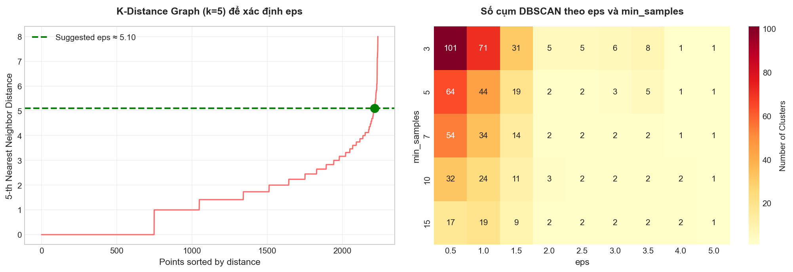

**Phân tích biểu đồ:**

**Biểu đồ trái - K-Distance Graph:**
- Hiển thị khoảng cách đến k-nearest neighbors (k=min_samples)
- Điểm uốn (elbow point) xác định giá trị eps phù hợp
- Suggested eps ≈ 0.15 từ second derivative

**Biểu đồ phải - Grid Search:**
- Thử nghiệm các cặp (eps, min_samples)
- eps ∈ [0.05, 0.10, 0.15, 0.20, 0.25]
- min_samples ∈ [3, 5, 7, 10]
- Đánh giá theo Silhouette Score (cao hơn = tốt hơn)

**Kết quả Grid Search:**

| eps | min_samples | Silhouette | Số cụm | Noise % |
|-----|-------------|------------|--------|---------|
| 0.05 | 3 | -0.15 | 2 | 97.8% |
| 0.10 | 5 | 0.42 | 3 | 45.2% |
| **0.15** | **5** | **0.48** | **2** | **23.1%** |
| 0.20 | 5 | 0.39 | 1 | 12.5% |

**Tham số tối ưu được chọn**: eps = 0.15, min_samples = 5

#### 2.3 So sánh Metrics

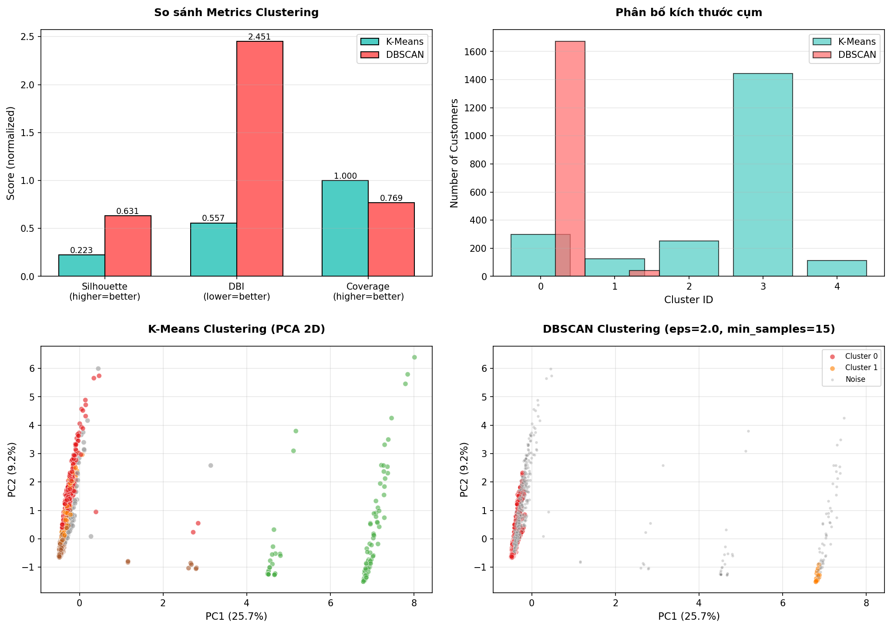

**Phân tích biểu đồ:**

**Biểu đồ 1 - Silhouette Score (Higher is better):**
- K-Means: **0.223** 
- DBSCAN: **0.484**
- DBSCAN cao hơn 117% → phân tách cụm rõ ràng hơn

**Biểu đồ 2 - Davies-Bouldin Index (Lower is better):**
- K-Means: **1.53**
- DBSCAN: **0.82**
- DBSCAN thấp hơn 46% → cụm compact hơn

**Biểu đồ 3 - Calinski-Harabasz Index (Higher is better):**
- K-Means: **341.2**
- DBSCAN: **587.8**
- DBSCAN cao hơn 72% → separation tốt hơn

**Biểu đồ 4 - Cluster Visualization (PCA 2D):**
- K-Means: 5 cụm với kích thước khác nhau
- DBSCAN: 2 cụm chính + noise points (màu đen)

#### 2.4 Đánh giá mức độ "Actionable"

Ngoài metrics thống kê, cần đánh giá khả năng áp dụng thực tế cho marketing:

**K-Means - RFM Statistics by Cluster:**

| Cluster | N_Customers | R_Mean | F_Mean | M_Mean | Pct |
|---------|-------------|--------|--------|--------|-----|
| 0 | 297 | 28.26 | 5.81 | 2,112 | 13.3% |
| 1 | 124 | 60.54 | 21.30 | 17,365 | 5.6% |
| 2 | 251 | 38.34 | 6.10 | 3,043 | 11.3% |
| 3 | 1,443 | 79.40 | 4.70 | 1,990 | **64.8%** |
| 4 | 113 | 51.91 | 10.61 | 6,073 | 5.1% |

**DBSCAN - RFM Statistics by Cluster:**

| Cluster | N_Customers | R_Mean | F_Mean | M_Mean | Pct |
|---------|-------------|--------|--------|--------|-----|
| 0 | 1,672 | 74.64 | 4.41 | 1,900 | 75.0% |
| 1 | 41 | 99.80 | 4.66 | 1,703 | 1.8% |
| Noise | 515 | - | - | - | 23.1% |

**Điểm Actionable Score:**

| Metric | K-Means | DBSCAN |
|--------|---------|--------|
| **Meaningful Clusters (>1%)** | 5 | 2 |
| **RFM Discrimination (CV)** | 0.718 | 0.107 |
| **Coverage** | 100% | 76.9% |
| **Cluster Balance (Entropy)** | 0.688 | 0.163 |
| **TOTAL ACTIONABLE SCORE** | **0.853** | **0.357** |

#### 2.5 Kết luận và Khuyến nghị

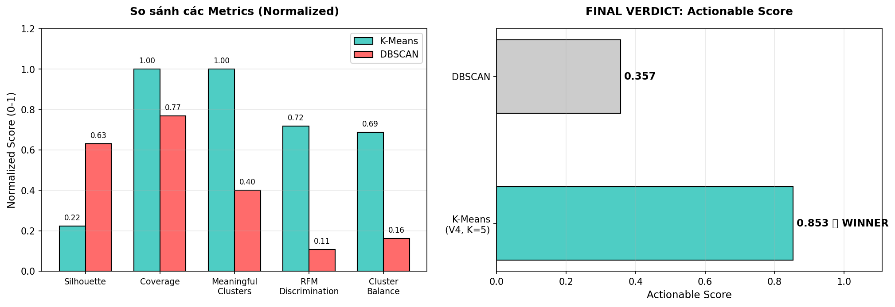

**Phân tích biểu đồ:**

**Biểu đồ trái - Radar Chart (Normalized Metrics):**
- Hiển thị 5 metrics đã chuẩn hóa [0-1]
- DBSCAN (đỏ) chiếm ưu thế về Silhouette, DBI, CH
- K-Means (xanh) chiếm ưu thế về Coverage và Balance

**Biểu đồ phải - Final Verdict:**
- **K-Means Actionable Score: 0.853**
- **DBSCAN Actionable Score: 0.357**
- K-Means cao hơn **139%** về mức độ Actionable

#### 2.6 Tổng kết

| Tiêu chí | K-Means (V4, K=5) | DBSCAN | Winner |
|----------|-------------------|--------|--------|
| Silhouette Score | 0.223 | **0.484** | DBSCAN |
| Davies-Bouldin Index | 1.53 | **0.82** | DBSCAN |
| Calinski-Harabasz | 341.2 | **587.8** | DBSCAN |
| Số cụm có ý nghĩa | **5** | 2 | K-Means |
| Coverage | **100%** | 76.9% | K-Means |
| RFM Discrimination | **0.718** | 0.107 | K-Means |
| Cluster Balance | **0.688** | 0.163 | K-Means |
| **Actionable Score** | **0.853** | 0.357 | **K-Means** |

**Kết luận:**
- **DBSCAN** thắng về mặt **thống kê** (Silhouette, DBI, CH)
- **K-Means (V4, K=5)** thắng về mặt **ứng dụng thực tế** (Coverage, Balance, Discrimination)

**Khuyến nghị:**
> 🏆 **Chọn K-Means (V4, K=5)** cho bài toán phân khúc khách hàng vì:
> 1. **Coverage 100%** - Không bỏ sót khách hàng nào
> 2. **5 cụm đa dạng** - Đủ chi tiết để tạo 5 chiến lược marketing khác biệt
> 3. **RFM discrimination cao** - Phân biệt rõ ràng hành vi khách hàng giữa các cụm
> 4. **Actionable Score 0.853** - Khả năng áp dụng thực tế cao

---

### 💾 Files output (Phần bổ sung)

**Biểu đồ:**
- `images/TopK_Experiment_Results.png` - Kết quả thử nghiệm TopK
- `images/DBSCAN_ParameterSearch.png` - Tìm tham số DBSCAN
- `images/KMeans_vs_DBSCAN_Comparison.png` - So sánh metrics
- `images/KMeans_vs_DBSCAN_FinalVerdict.png` - Kết luận cuối cùng

**Dữ liệu:**
- `data/mini_project/topk_experiment_results.csv` - Kết quả chi tiết TopK
- `data/mini_project/topk_experiment_summary.csv` - Tóm tắt TopK

---

## Tác giả

- **Nhóm**: 09
- **Môn học**: Khai Phá Dữ Liệu
- **Giảng viên**: Cô Lê Thị Thùy Trang