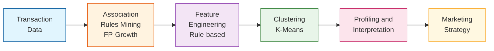

# 🛒 Mini Project: Phân Cụm Khách Hàng Dựa Trên Luật Kết Hợp

## Mục lục
- [Giới thiệu](#giới-thiệu)
- [Yêu cầu 1: Khai thác luật kết hợp](#yêu-cầu-1-khai-thác-luật-kết-hợp)
- [Yêu cầu 2: Feature Engineering](#yêu-cầu-2-feature-engineering) *(Đang phát triển)*
- [Yêu cầu 3: Phân cụm K-Means](#yêu-cầu-3-phân-cụm-k-means) *(Đang phát triển)*
- [Cài đặt và Chạy](#cài-đặt-và-chạy)

---

## Giới thiệu

Dự án này xây dựng pipeline phân khúc khách hàng theo hướng:



### Dữ liệu
- **Nguồn**: Online Retail Dataset
- **Số giao dịch**: 18,021 hóa đơn
- **Số sản phẩm**: 4,007 items

---

## Yêu cầu 1: Khai thác luật kết hợp

### 📋 Yêu cầu đề bài

> *"Mỗi nhóm cần chạy pipeline để tạo ra hoặc sử dụng lại danh sách luật kết hợp (rules) từ Apriori hoặc FP-Growth. Nhóm phải trình bày rõ ràng cách mình chọn luật: lấy Top-K bao nhiêu luật, ưu tiên sắp xếp theo lift hay confidence, có áp dụng ngưỡng lọc tối thiểu min_support, min_confidence, min_lift hay không và vì sao. Kết quả lựa chọn luật cần được minh chứng bằng việc trích ra một bảng nhỏ khoảng 10 luật tiêu biểu kèm theo các chỉ số (support, confidence, lift) để người đọc thấy được chất lượng luật mà nhóm dùng làm đầu vào cho bước phân cụm."*

### ✅ Những phần đã thực hiện

#### 1.1. Thiết lập môi trường và tham số ban đầu
- Cấu hình đường dẫn dữ liệu đầu vào/đầu ra
- Thiết lập tham số khai thác tập phổ biến:
  - `MIN_SUPPORT_FI = 0.01` (1%)
  - `MAX_LEN = 3` (tối đa 3 sản phẩm/itemset)
  - `METRIC = "lift"` (ưu tiên sắp xếp theo lift)
  - `MIN_THRESHOLD = 1.0` (chỉ giữ luật có lift >= 1)

#### 1.2. Khai thác luật kết hợp bằng FP-Growth
- **Thuật toán**: FP-Growth (nhanh hơn Apriori)
- **Kết quả khai thác**:
  - Số tập phổ biến: **2,120 itemsets**
  - Tổng số luật sinh: **3,856 luật**
  - Thời gian khai thác: ~65s

#### 1.3. Khảo sát ảnh hưởng của các tham số (Grid Search)


**Phân tích biểu đồ:**
- **Biểu đồ trái (min_support)**: Khi tăng min_support từ 0.005 lên 0.03, số luật giảm mạnh từ ~2,445 xuống còn ~22 luật. Điểm min_support=0.01 (đường xanh) cho khoảng 2,445 luật - đủ lớn để có sự đa dạng nhưng không quá nhiều.
- **Biểu đồ giữa (min_confidence)**: Số luật giảm dần khi tăng confidence. Tại confidence=0.3, còn 1,794 luật với avg_lift=13.57 - cân bằng tốt giữa số lượng và chất lượng.
- **Biểu đồ phải (min_lift)**: Lift có ảnh hưởng nhẹ hơn, từ 1.0 đến 3.0 số luật chỉ giảm từ 2,445 xuống 2,302. Chọn lift=1.5 để loại bỏ các luật liên kết yếu.

**Kết luận**: min_support là tham số ảnh hưởng mạnh nhất, cần chọn cẩn thận để cân bằng số lượng-chất lượng.

#### 1.4. Phân tích Trade-off: Số lượng vs Chất lượng

- Khảo sát **27 tổ hợp** tham số khác nhau
- Sử dụng **Quality Score = avg_lift × avg_confidence** để đánh giá
- Lọc các cấu hình có **50-500 luật** (phù hợp cho phân cụm)


**Phân tích biểu đồ:**
- **Biểu đồ trái (Scatter)**: Mỗi điểm là một tổ hợp tham số. Trục X là số luật, trục Y là quality score. Màu xanh lá = lift cao, màu đỏ = lift thấp. Vùng giữa 2 đường đứt đỏ (50-500 luật) là vùng phù hợp cho phân cụm.
- **Biểu đồ phải (Top 5)**: 5 cấu hình có quality score cao nhất trong vùng 50-500 luật:
  - Cấu hình tốt nhất: sup=0.015, conf=0.4, lift=1.5 với 347 luật, quality_score=5.94
  - Các cấu hình có confidence=0.4 cho quality score cao hơn confidence=0.3

**Kết luận**: Chọn cấu hình cân bằng với min_support=0.01, min_confidence=0.3, min_lift=1.5 để có đủ luật (200) mà vẫn đảm bảo chất lượng.

#### 1.5. Kết luận chọn tham số tối ưu

Dựa trên kết quả Grid Search và phân tích Trade-off, **tham số được chọn**:

| Tham số | Giá trị | Lý do |
|---------|---------|-------|
| **min_support** | 0.01 (1%) | Cân bằng giữa số lượng luật và ý nghĩa thống kê |
| **min_confidence** | 0.3 (30%) | Đảm bảo luật có khả năng dự đoán tốt |
| **min_lift** | 1.5 | Loại bỏ các cặp sản phẩm chỉ xuất hiện ngẫu nhiên |
| **TOP_K** | 200 | Đủ đa dạng cho phân cụm, không quá nhiều gây nhiễu |

**Sắp xếp ưu tiên**: Theo **Lift** (cao → thấp)

#### 1.6. Áp dụng tham số và lọc luật

Kết quả sau khi lọc:
- Số luật thỏa mãn điều kiện: **1,794 luật**
- Lấy Top-200 theo Lift: **200 luật**

### 📊 Kết quả

#### Thống kê luật đã lọc

| Chỉ số | Min | Max | Mean |
|--------|-----|-----|------|
| **Support** | 0.0101 | 0.0204 | 0.0116 |
| **Confidence** | 35.33% | 97.57% | **72.97%** |
| **Lift** | 20.04 | 74.57 | **42.19** |

#### Phân phối độ dài Antecedent
- 1 sản phẩm: **139 luật (69.5%)**
- 2 sản phẩm: **61 luật (30.5%)**

### 📋 Bảng 10 luật tiêu biểu (sắp xếp theo Lift)

| STT | Antecedent (Mua trước) | Consequent (Mua kèm) | Support | Confidence | Lift |
|-----|------------------------|----------------------|---------|------------|------|
| 1 | HERB MARKER PARSLEY, HERB MARKER ROSEMARY | HERB MARKER THYME | 0.0109 | 95.17% | **74.57** |
| 2 | HERB MARKER MINT, HERB MARKER THYME | HERB MARKER ROSEMARY | 0.0106 | 95.50% | **74.50** |
| 3 | HERB MARKER MINT, HERB MARKER THYME | HERB MARKER PARSLEY | 0.0104 | 94.00% | **74.30** |
| 4 | HERB MARKER PARSLEY, HERB MARKER THYME | HERB MARKER ROSEMARY | 0.0109 | 95.17% | **74.24** |
| 5 | HERB MARKER BASIL, HERB MARKER THYME | HERB MARKER ROSEMARY | 0.0107 | 95.07% | **74.17** |
| 6 | HERB MARKER BASIL, HERB MARKER ROSEMARY | HERB MARKER THYME | 0.0107 | 93.69% | **73.41** |
| 7 | HERB MARKER MINT, HERB MARKER ROSEMARY | HERB MARKER THYME | 0.0106 | 93.17% | **73.00** |
| 8 | HERB MARKER MINT, HERB MARKER ROSEMARY | HERB MARKER PARSLEY | 0.0105 | 92.20% | **72.87** |
| 9 | HERB MARKER BASIL, HERB MARKER THYME | HERB MARKER PARSLEY | 0.0104 | 92.12% | **72.81** |
| 10 | HERB MARKER CHIVES | HERB MARKER PARSLEY | 0.0104 | 92.12% | **72.81** |

**Giải thích ý nghĩa các chỉ số:**
- **Support**: Tỷ lệ giao dịch chứa cả antecedent và consequent
- **Confidence**: Xác suất mua consequent khi đã mua antecedent
- **Lift**: Độ mạnh liên kết so với ngẫu nhiên (Lift > 1 = liên kết dương)

### 📈 Trực quan hóa kết quả

#### 1. Phân phối độ dài Itemset (Frequent Itemsets)


**Phân tích dữ liệu từ biểu đồ:**
- Tổng số tập phổ biến: **2,120 itemsets**
- Itemset 1 sản phẩm: chiếm đa số (~1,500+ itemsets)
- Itemset 2 sản phẩm: ít hơn (~500+ itemsets)
- Itemset 3 sản phẩm: rất ít (do MAX_LEN=3)

**Ý nghĩa**: Đa số itemsets đơn giản (1-2 sản phẩm), cho thấy khách hàng thường mua theo cặp sản phẩm. Điều này phù hợp để sinh luật kết hợp dạng "A → B" đơn giản, dễ diễn giải cho marketing.

---

#### 2. Top 15 luật theo Lift


**Phân tích dữ liệu từ biểu đồ:**
- **Top 1**: HERB MARKER PARSLEY, ROSEMARY → THYME (Lift = 74.57)
- **Top 2-15**: Đều là các sản phẩm trong bộ HERB MARKER với Lift từ 72-74
- Tất cả 15 luật đều có **Lift > 70** - liên kết cực mạnh

**Ý nghĩa**: Bộ sản phẩm HERB MARKER (đánh dấu thảo mộc) là nhóm được mua kèm nhiều nhất. Khách mua 1-2 loại HERB MARKER có khả năng mua thêm các loại khác **gấp 70+ lần** so với ngẫu nhiên. Đây là cơ hội tốt cho chiến lược **bundle/cross-sell**.

---

#### 3. Scatter Plot: Support vs Confidence (màu theo Lift)


**Phân tích dữ liệu từ biểu đồ:**
- Trục X: Support (0.01 - 0.02), trục Y: Confidence (0.35 - 1.0)
- Màu xanh lá đậm: Lift cao (>60), màu vàng-đỏ: Lift thấp hơn (20-40)
- Đường đứt nét đỏ: min_confidence = 0.3
- Đường đứt nét xanh: min_support = 0.01
- Các điểm tập trung ở **góc trên phải** (confidence cao, support thấp)

**Ý nghĩa**: 200 luật được chọn đều vượt ngưỡng lọc. Luật có Lift cao nhất (xanh đậm) thường có Confidence cao (>90%) nhưng Support tương đối thấp (~1%). Điều này hợp lý vì các cặp sản phẩm liên kết mạnh thường là sản phẩm chuyên biệt (như HERB MARKER).

---

#### 4. Phân phối Lift (Histogram)


**Phân tích dữ liệu từ biểu đồ:**
- Phân phối Lift: từ **20** đến **75**
- **Mean Lift = 42.19** (đường đỏ)
- **Median Lift ≈ 40** (đường cam)
- Phần lớn luật có Lift trong khoảng **25-50**
- Có một nhóm nhỏ luật đặc biệt với Lift **>70** (outliers tích cực)

**Ý nghĩa**: Tất cả 200 luật đều có Lift **rất cao** (>20), chứng tỏ việc chọn TOP-K theo Lift hiệu quả. Không có luật nào có Lift thấp (<20) trong tập đã lọc. Điều này đảm bảo các luật đều có giá trị thực tế cho phân cụm.

---

#### 5. Phân phối các Metrics (Boxplot)


**Phân tích dữ liệu từ biểu đồ:**

| Metric | Min | Median | Max | Nhận xét |
|--------|-----|--------|-----|----------|
| **Support** | 0.0101 | ~0.011 | 0.0204 | Tập trung, ít outliers |
| **Confidence** | 0.35 | ~0.75 | 0.98 | Range rộng, nhiều biến thiên |
| **Lift** | 20.04 | ~40 | 74.57 | Có outliers cao |

**Ý nghĩa**: 
- Support đồng đều → các luật xuất hiện với tần suất tương đương
- Confidence đa dạng → có luật mạnh (>90%) và luật vừa (35-50%)
- Lift cao đều → tất cả luật đều có liên kết mạnh

---

#### 6. Phân phối độ dài Antecedent


**Phân tích dữ liệu từ biểu đồ:**
- **1 sản phẩm**: 139 luật (**69.5%**)
- **2 sản phẩm**: 61 luật (**30.5%**)

**Ý nghĩa**:
- Đa số luật có dạng đơn giản: "Mua A → Gợi ý B"
- Khoảng 1/3 luật có dạng: "Mua A và B → Gợi ý C"
- Luật đơn giản (1 antecedent) dễ áp dụng cho recommendation real-time
- Luật phức tạp (2 antecedents) chính xác hơn nhưng cần khách đã mua 2 sản phẩm

---

### 💾 File output

Luật đã lọc được lưu tại: `data/mini_project/rules_fpgrowth_filtered.csv`

---

## Yêu cầu 2: Feature Engineering

*(Đang phát triển...)*

---

## Yêu cầu 3: Phân cụm K-Means

*(Đang phát triển...)*

---

## Cài đặt và Chạy

### Yêu cầu môi trường
```bash
conda activate KhaiPhaDuLieu_ShoppingCartAnalysis
```

### Cài đặt dependencies
```bash
pip install -r requirements.txt
```

### Chạy notebook
Mở file `notebooks/ShopCluster.ipynb` và chạy từng cell theo thứ tự.

---

## Cấu trúc thư mục

```
ShopCluster/
├── data/
│   ├── raw/                    # Dữ liệu thô
│   │   └── online_retail.csv
│   ├── processed/              # Dữ liệu đã xử lý
│   │   └── basket_bool.parquet
│   └── mini_project/           # Output của Mini Project
│       └── rules_fpgrowth_filtered.csv
├── images/                     # Biểu đồ trực quan
│   ├── Req1_*.png
│   └── ...
├── notebooks/
│   └── ShopCluster.ipynb       # Notebook chính
├── src/
│   └── cluster_library.py      # Thư viện hỗ trợ
├── README.md
└── requirements.txt
```

---

## Tác giả

- **Nhóm**: 09
- **Môn học**: Khai Phá Dữ Liệu
- **Giảng viên**: Cô Lê Thị Thùy Trang